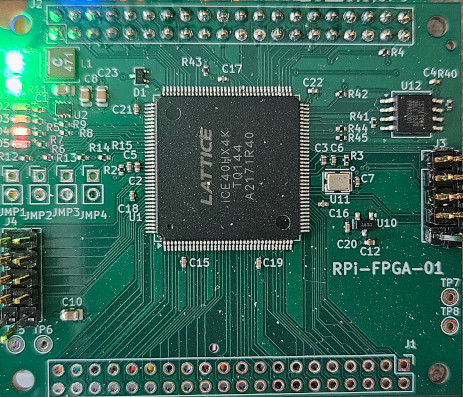

# RPi-FPGA-01

  

The RPi-FPGA-01 is a fully open source (GPLv3) hardware design. It contains a Lattice ice40HX4K FPGA and a 40-pin header. It is intended to plug into a Raspberry Pi. It contains 56 I/O to the "outside" world via three headers and connects to all 28 GPIO pins of the Raspberry Pi. It is a 4-layer PCB with components on one side.

Aside from a few JMP inputs and LEDs, it is intended to be a simple board. It is just an FPGA designed to sit between a Raspberry Pi and any other circuit. The I/O lines are completely unprotected so static electricity from a human touching any of the IO could ruin the FPGA; please be careful.

(The IceZero was not ideal for my purposes. It had extra components, and GPIO lines were organized inefficiently for what I had in mind. Therefore I designed my own PCB.)

The [KiCad](https://github/ddommett/RasPi_FPGA/03-RPi-FPGA-01/KiCad) folder contains the KiCad project, schematic, and PCB layout design. 

The [gerbers](https://github/ddommett/RasPi_FPGA/03-RPi-FPGA-01/KiCad/gerbers) subfolder contains the gerber files for manufacture. 

The [production](https://github/ddommett/RasPi_FPGA/03-RPi-FPGA-01/KiCad/production) subfolder contains extra files useful for manufacture. I had [JLCPCB](https://jlcpcb.com/) manufacture the PCBs, supply the components, and assemble the board.

RPi-FPGA-01.csv contains a bill of materials for all components on the RPi-FPGA-01 that is in the correct format to upload to JLCPCB during the ordering process. 

jlcpcb-all-cpl.csv contains a list of positions and rotations for all components, uploadable to JLCPCB during their ordering process that enables their pick-and-place machine to perform the assembly.

## License
The RPi-FPGA-01 is an open source project licensed under GPLv3.  Please see the included LICENSE file for details.  If you do wish to distribute boards derived from this open source hardware project then you must also release the source files for the boards under GPLv3.  You are free to do this, but please improve upon the original design and provide a tangible benefit for users of the board.
