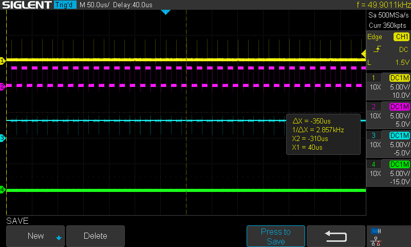

# A 'Bare Metal' App

<a id="readme-bare-metal"></a>

The [circle](https://github.com/rsta2/circle) project enables the creation of a bare metal app that will run on the Raspberry Pi without needing any operating system. It comes with instructions on how to build examples and how to create a bootable SD card. When run in this manner, the app is loaded and executed on powerup. 

To compile this project it is necessary to download and install circle. Then copy the '09-Bare-Metal' folder into the 'sample' folder in the circle project (necessary because it uses similar relative paths like the other samples). Then build it:

```bash
cd <path to circle>/sample/09-Bare-Metal
make
```

This will create a 'kernel7l.img' file. Follow the instructions carefully (including config .txt files etc.) in the circle readme.md to create an SD card and copy this kernel7l.img file onto the SD card, then boot the Raspberry Pi 4 from the SD card. Note this will only work on a Raspberry Pi 4 as it manipulates registers directly (much more common in bare metal apps).

<div align="center">
  <a href="https://github.com/ddommett/RasPi_FPGA">
    
  </a>
</div>

When booting from a SD card containing this app as the kernel image, it prints some text to the screen and then immediately goes into a forever loop to read data packets from the FPGA. While it is difficult to see in the above image, the signals on the scope are very stable and have **no** timing jitter. When the scope was set to trigger on the 'FIFO full' signal, it NEVER triggered in a 90 minute test.

It is not surprising that a bare metal app would keep up with the real-time task. (In fact, the scope shows that it is handling each data packet as it occurs every 20us, so the FIFO is never holding more than one packet.) There are no other tasks running (there is no OS). In fact, 3 of the cores are doing nothing while this app runs in bare metal mode. This proves that the Raspberry Pi 4 *hardware* is fully capable of the high-performance real-time task.

## License
This software is an open source project licensed under GPLv3.  Please see the included LICENSE file for details.  If you do wish to distribute software derived from this open source software project then you must also release the source files for the software under GPLv3.  You are free to do this, but please improve upon the original design and provide a tangible benefit for users of the software.
