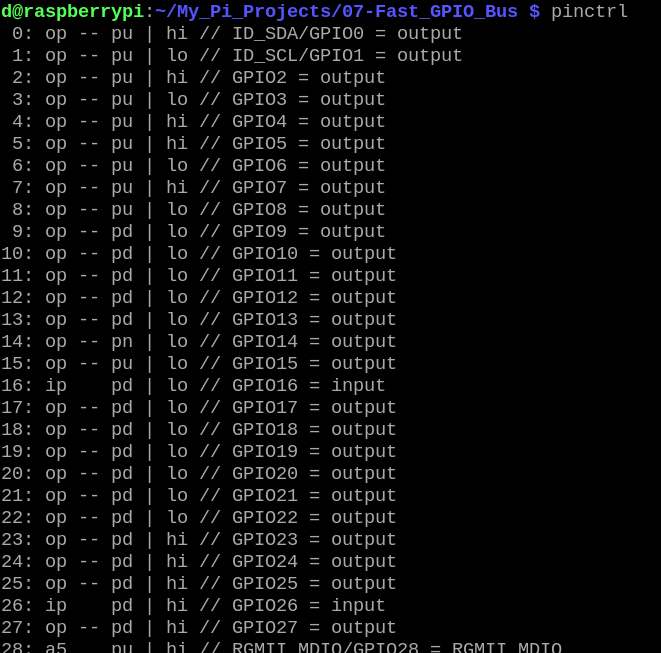
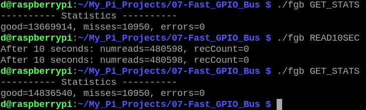
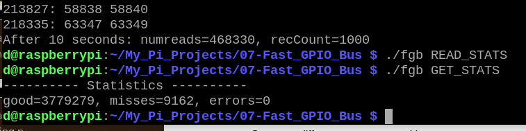
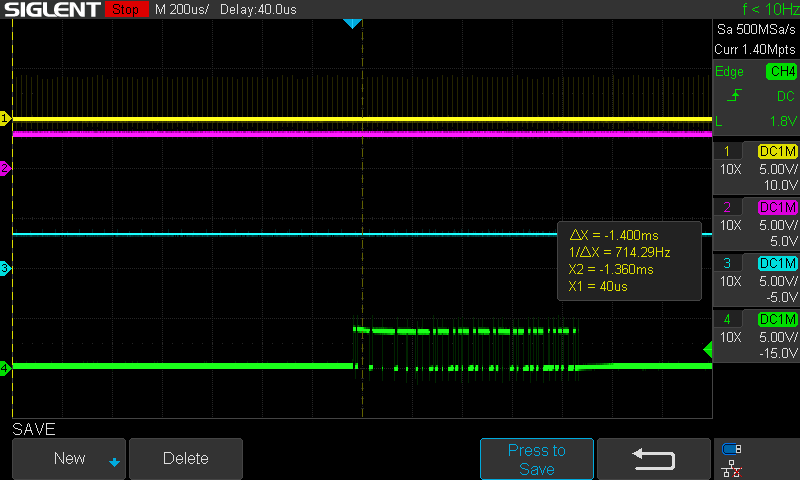
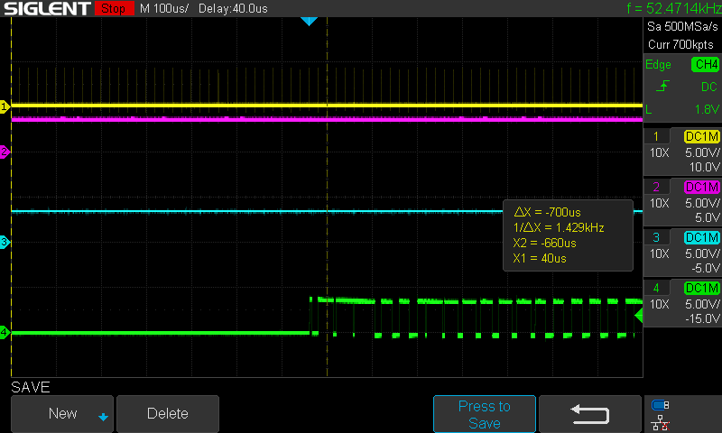

[Back to Main](./readme.md)

# Fast GPIO Bus

<a id="readme-fast-gpio-bus"></a>

So far, nothing has helped a userspace application transfer data from an FPGA to a Raspberry Pi without loss of data.

What if we write a kernel module? A kernel module runs in 'kernel space' not 'user space' and that gives it certain benefits. 

Let's write a kernel module device driver to continually transfer data from the FPGA and it will be called 'Fast-GPIO-Bus'. 

This project consists of three parts: a device tree overlay, a kernel module, and a userspace C application. The device tree overlay will inform the Linux system that the driver will use the GPIO pins. The kernel module will configure the FPGA and continually read packets from the FIFO in the FPGA and store those packets in memory (in a ring buffer). The userspace application will pass commands to the kernel module and will read packets from the in-memory ring buffer.

## Device Tree Overlay

In the embedded world, the device tree has become the standard for specifying the hardware devices available in a system. By using 'device tree overlays' you can change or add capabilities to a system. The device tree seems like it adds a layer of complexity that a person must understand, but maybe it's worth it, as it helps all devices and drivers play nicely with each other. I'm not going to be installing other devices on my GPIO pins, I'm just going to write code that grabs control directly of the hardware registers, but I will do my best to work within the device tree guidance.

These overlays can be loaded at boot time or dynamically later. 

The file 'fast_gpio_bos_overlay.dts' describes and names all 28 GPIO pins to be used in the kernel mdule. A text overlay file must be compiled into a binary .dtbo file:

```bash
cd 05-Device-Tree-Overlay
make
```
An overlay can be loaded with a command like:

```bash
sudo dtoverlay fast_gpio_bus_overlay.dtbo
```

Success can be verified with:

```bash
dtoverlay -l
```

This device tree overlay specifies that it is only compatible with the Broadcom chip used on the Raspberry Pi 4, and it specifies which GPIO pins the driver uses (all of them). Inside the kernel module, there will be code which calls into the gpiod kernel library to request access to these pins. If another device driver has already been granted access to these pins, my driver will fail to load. Likewise, if my driver is loaded and another driver attempts to access these pins through requests to gpiod, it will fail. I don't think I really need to do this in order to make my driver function because I'm not going to use gpiod to manipulate the GPIO pins, but it should help provide error messages as necessary if conflicts arise on a system during testing.

After the device tree overlay is loaded, 'pinctrl' can be run to see information about the GPIO pins:

<div align="center">
  <a href="https://github.com/ddommett/RasPi_FPGA">
    
  </a>
</div>


## Kernel Module

The kernel driver code is in 06-LKM-Fast-GPIO-Bus/fast_gpio_bus.c. Build it with:

```bash
cd 06-LKM-Fast_GPIO-Bus
make
```

It can be loaded with:

```bash
sudo insmod fast_gpio_bus.ko
```

It can be unloaded with:

```bash
sudo rmmod fast_gpio_bus.ko
```

When loading, the kernel module requests access to the GPIO pins via calls to gpiod. Once successful, no other kernel module can gain access to these pins. (However, nothing stops another module from writing directly to the hardware registers.)

After getting access to these pins, it starts a high resolution timer to fire every 20us. High resolution timers did not exist in the early days of Linux; they are intended for use by drivers that need very precise timing (nanoseconds). We'll see how well they work for this task. When the timer fires, a fuction will be called and that function will check to see if there is data available to read from the FIFO. If data is available, it will try to read as many packets as it can until the FIFO is empty. In an ideal situation, every 20us a packet is written into the FIFO by the FPGA, and once every 20us, our function will read the packet.

After getting access to these pins, it creates a /proc/fast-gpio-bus that will be used by a userspace application to read data packets. The kernel module will maintain a ring buffer to hold 1024 packets. (A buffer of 1024 packets covers more than 20ms.)

## An App to read from the Kernel Module

The fgb project is a simple C application that is used to test the performance of the kernel module under no load and light load. To build it:

```bash
cd 07-fgb
make
```

The fgb app takes command line parameters from the user and interacts with the kernel module. These commands are:

```bash
./fgb GET_STATS
./fgb GET_STATUS
./fgb GET_REGS
./fgb GET_ERROR_ARRAY
./fgb START
./fgb STOP
./fgb RESET
./fgb CONFIG_FPGA <filename>
./fgb READ1
./fgb READ10SEC
./fgb READ1MIN
```

A command like 'READ10SEC' will read continuously from the kernel module for 10 seconds and then report how many packets were read and how many failures it recorded. The 'GET_STATS' command will report how many packets have been lost.

## Testing

Let's see an example of how build, install, and use all 3 parts of this project starting from the main installation folder (replace <path to project> appropriately):

```bash
cd 05-Device-Tree-Overlay
make
sudo dtoverlay fast_gpio_bus_overlay.dtbo
cd ..
cd 06-LKM-Fast_GPIO-Bus
make
sudo insmod fast_gpio_bus.ko
cd ..
cd 07-fgb
make
./fgb CONFIG_FPGA <path to project>/03-RPi-FPGA-01-FIFO/RPi-FPGA-01.bin
./fgb START
./fgb GET_STATS
./fgb READ10SEC
./fgb GET_STATS
sudo rmmod fast_gpio_bus.ko
```

When the kernel module is loaded, it starts in a 'STOPPED' state (it is not continually reading from the FPGA), and it does not configure the FPGA. (Although the FPGA is likely happily running from the onboard flash.) The CONFIG_FPGA command will command the kernel module to open the given file and configure the FPGA, which also resets it. The START command tells the kernel module to continually read packets from the FPGA FIFO and place them into a ring buffer. GET_STATS will print some statistics. 

The READ10SEC command does more than just call a function in the kernel module. It will read from the kernel module /proc/fast-gpio-bus file until the ring buffer is empty, then it will loop for 10 seconds, continually reading packets from the kernel module. After 10 seconds, it will report on any failures and number of packets read.

Here is an example of it running in the terminal:

<div align="center">
  <a href="https://github.com/ddommett/RasPi_FPGA">
    
  </a>
</div>

The above image shows fgb running for 10 seconds to continually read packets from the kernel module. It read 480,598 packets and had no failures. The GET_STATS command before and after also shows that the number of missed packets stayed the same for this 10 second period. This seems like a good start; the kernel module is working and there are no missed data packets.

Let's see how it handles a light load, running for 10 seconds while a gvim editor window is scrolling.

<div align="center">
  <a href="https://github.com/ddommett/RasPi_FPGA">
    
  </a>
</div>

After 10 seconds, it had read 468,30 packets, and it had recorded over 1000 failures, and it missed 9162 packets. This is an error rate of almost 2%. This is very disappointing!

But wait, the kernel module contains a ring buffer, maybe this was overflowing or erroneous? Or, maybe the fgb app, being a userspace app, was not keeping up with everything? No, the following image can show that the 'FIFO full' signal (green) is activating on the FPGA, which means that we can be sure the failures are due to the kernel module being interrupted enough that it cannot get packets from the FPGA without loss.

<div align="center">
  <a href="https://github.com/ddommett/RasPi_FPGA">
    
  </a>
</div>

So there it is! All that effort to write a kernel module and it cannot maintain reliable data transfer! (I repeated this with a 'standard' and 'real-time' kernel and there was no significant difference.)

## Kernel Module - IRQ based Fast GPIO Bus

A kernel module based upon a high resolution timer did not seem to help. Another thing we can try is to use a kernel module with interrupts. A GPIO pin can generate an interrupt to the system and trigger a function call. So it ought to be possible to generate an interrupt from the 'data available' (FRAME) signal and jump right to our function, interrupting other processes that are running.

This is actually where the device tree overlay file had one point of importance. If a GPIO pin has not been defined as an input, the request for an irq is refused. In the following line in the overlay file, it was important the the pin be defined as an input (the zero).

```bash
				frame-gpio =      <&gpio 23 0>; 
```

So no changes were needed to the overlay file since this was already in the device tree overlay file.

The fast_gpio_bus.c file is modified. Instead of starting a kthread and a hrtimer, it defines an interrupt function to be called by the Linux kernel. It uses the gpio library to request an irq on the GPIO pin and it passes the address of the function to the kernel. In this manner, each time the 'data available' signal goes high, this function *should* be called almost immediately. (Online documents really recommend using a hrtimer over this approach. Afterall, Linux still hooks its own functions to the hardware service vectors, and when my function is called is still at the discretion of the Linux kernel. Based upon online documents, this interrupt driven approach is unlikely to make any improvement over using the hrtimer, but again, let's try it and see.)

To avoid the interrupt firing while the kernel module is loading, the FPGA is held in a reset state until the userspace app 'fgb' signals it to start. Let's see how to build and use this (assuming that the device tree overlay is already loaded and fgb has been built):

```bash
cd 08-LKM-IRQ
make
sudo insmod fast_gpio_bus.ko
cd ..
cd 07-fgb
./fgb START
```

To see if any progress is made, it's sufficient to just know if scrolling an editor window is causing the FIFO to fill up or not. So I set the scope to trigger on the full signal and I start scrolling a gvim window and immediately the scope is triggered. (The 'FIFO full' signal (green) indicates the kernel module, now interrupt driven, is not keeping up with the data transfer.)

<div align="center">
  <a href="https://github.com/ddommett/RasPi_FPGA">
    
  </a>
</div>

All the effort with kernel modules and still we cannot reliably transfer data at the required rate. Aside from 'do not touch the system while it is running', it would seem like this is the end.

Or is it?

The next part of the story compares Wayland and X11 and what happens next is surprising and educational.

[Back to Main](./readme.md) or [Next](./Wayland_X11.md)
