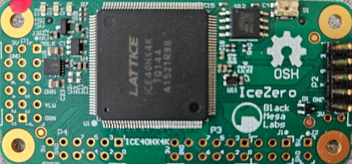
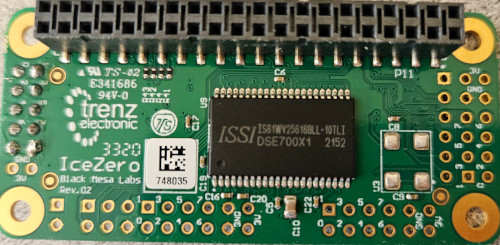
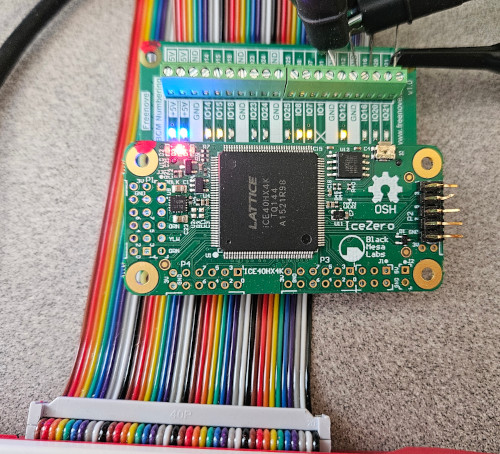

# IceZero FPGA for RasPi

[Back to Main](./readme.md)

<a id="readme-icezero"></a>
<div align="center">
 <a href="https://github.com/ddommett/RasPi_FPGA">
    
  </a>
</div>
<div align="center">
 <a href="https://github.com/ddommett/RasPi_FPGA">
    
  </a>
</div>

The *IceZero FPGA Board for RasPi* is a Lattice FPGA board from Black Mesa Labs in the form factor of the Raspberry Pi Zero with a 40-pin connector which enables it to plug onto a Raspberry Pi like all other HATs.

https://blackmesalabs.wordpress.com/2017/02/07/icezero-fpga-board-for-rasppi/

They could be purchased from:

https://www.trenz-electronic.de/en/Products/Trenz-Electronic/Open-Hardware/IceZero/

When I looked, they had three in stock, and knowing that this was a design implemented back in 2017 (it was now 2025), I bought one right away.

I was going to use the IceZero as a development board to familiarize myself with the open source tool chain OSS-CAD-Suite for Lattice FPGAs.

As it had been some years since the IceZero was designed and documented, the information for getting started with an example was outdated as some of the tools had changed.

If you have an IceZero, here are some instructions on how to get the original example to work with it. Note, I did this on a Pi 400 running the Raspberry Pi OS (Linux) - the "Full" version and therefore tools like gcc were already installed.

In summary, what we are going to do is:
1) Install oss-cad-suite, arachne-pnr, and WiringPi
2) Build a .bin file for the FPGA
3) Build a C app to program the FPGA and communicate with it.

Download the latest oss-cad-suite from [https://github.com/YosysHQ/oss-cad-suite-build/releases)](https://github.com/YosysHQ/oss-cad-suite-build/releases). For me, on a Raspberry Pi 400, I downloaded the latest 64-bit arm version: oss-cad-suite-linux-arm64-*.tgz and I copied it to my home folder. Then I unzipped it and added it to my path variable (also added it to my ~/.bashrc with a sed command so it would remain active after rebooting):

```bash
tar -xvf oss*.tgz
export PATH="/home/d/oss-cad-suite/bin:$PATH"
sed -i '$a\export PATH="/home/d/oss-cad-suite/bin:$PATH" ' ~/.bashrc 
```
(/home/d is *my* home folder - change it to match your home folder.) You can now verify oss-cad-suite is installed by typing:

```bash
yosys
```

and you should see yosys start (press CTRL-z to exit).

Here is how I got an original example from 'icotools' working on the IceZero in 2025:

To get an example for IceZero, go to 

[https://github.com/cliffordwolf/icotools](https://github.com/cliffordwolf/icotools)

Download the icotools project as a zip and unzip it in your home folder. Then type:

```bash
cd icotools-master/examples/icezero
make
```

At first, this will get an error because arachne-npr is not found. (This is a place-and-route program which has been superceeded by next-pnr; next-pnr comes with oss-cad-suite) Download zip from:

[https://github.com/YosysHQ/arachne-pnr](https://github.com/YosysHQ/arachne-pnr)

Extract the zip file then:

```bash
cd arachne-pnr-master
make && sudo make install
```

It will produce some errors saying it cannot find chip-384.txt (and other missing files). These needed files are in ~/oss-cad-suite/share/icebox/ so type the following to put them in a place where the arachne-pnr makefile will find them:

```bash
sudo mkdir /usr/local/share/icebox
sudo cp ~/oss*suite/share/icebox/*.txt /usr/local/share/icebox
```

Now repeat arachne-pnr make and make install.

```bash
make && sudo make install
```

If all is well, you should see no errors and arachne-pnr is now correctly installed. Back to building the icotools example...

```bash
cd ~/icotools-master/examples/icezero
make
```

You should see no errors. What has happened here, is that 'make' has compiled an example verilog design into a .bin file suitable for programming into a Lattice ice40 FPGA (it succeeds because we have installed arachne-pnr). What we need to do next, is compile the example C app which will actually send the .bin file to the FPGA on the IceZero.

```bash
make icezprog
```

Straight away you will discover that it relies on the WiringPi library. If you read online about WiringPi, you will find a lot of conflicting information about how it was obsoleted, how other libraries are more relevant etc. However, the project was picked up and is maintained (as of 2025) so you can get it and use it for icotools. So go to:

[https://github.com/WiringPi/WiringPi/releases](https://github.com/WiringPi/WiringPi/releases)

I downloaded the latest debian package for Arm-64 Debian for the Pi 400 (for me in 2025: wiringpi_3.16_arm64.deb). I extracted the zip and then installed it (make sure you are in the folder where the .deb file exists):

```bash
sudo apt install ./wiringpi_3.16_arm64.deb
```

(I get a notice warning that I ignore.) Now, go back into the icotools example folder and try to make the IceZero programming tool again:

```bash
cd ~/icotools-master/examples/icezero
make icezprog
```

Now is the time to connect the IceZero board to the Raspberry Pi. So if it is not already connected, turn off the Raspberr Pi and the IceZero, then power on the Pi. I have it connected to my Pi 400 with a 40-pin ribbon cable.

<div align="center">
 <a href="https://github.com/ddommett/RasPi_FPGA">
    
  </a>
</div>

The following command will program the FPGA and when complete (you will see some messages in the terminal as it reads back an ID), if all is successful, you will see the three LEDs blinking in sequence!

```bash
make prog
```

We have now successfully connected a FPGA to the Raspberry Pi 4!

<h2>Updated Alternative</h2>

To avoid needing to download and install arachne-npr, you can get a fork of icotools at [https://github.com/rhobbie/icotools](https://github.com/rhobbie/icotools) which is modified to work with next-pnr.

</p>

[Back to Main](./readme.md) or [Next](./UserApp.md)
