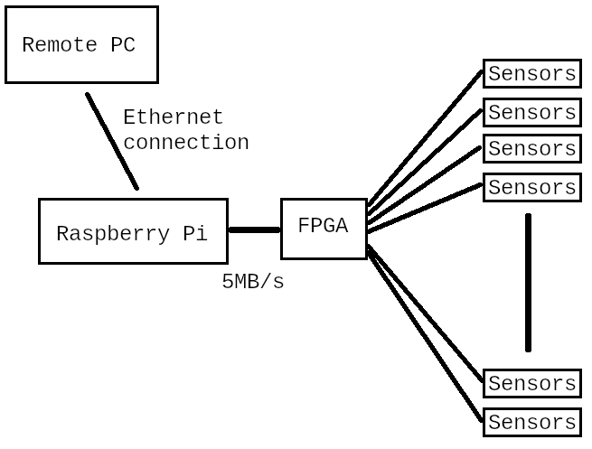

<h3 align="center">Introduction</h3>

[Back to Main](./readme.md)

A Raspberry Pi, running Linux, can leave a user wanting more when that user desires high-performance data transfer with the real world.
  
The Raspberry Pi *is* very useful for connecting a computer to the real world. Using SPI, I2C, and UARTs, on its general purpose (GPIO) 40-pin header, it can interface with all sorts of sensors and displays via a plethora of HATs (addon modules). Running Linux on a Raspberry Pi lets a user do all sorts of powerful and interesting things. 

However, Linux (the most common OS to run on Raspberry Pis) is not perfectly suited to real-time tasks, and the I/O speeds have limits.

When a user has an application that requires a custom design with real-time requirements and high amounts of data transfer, it is alluring to combine a Raspberry Pi (the power of Linux in a small circuit) with the power and flexibility of a FPGA (field programmable gate array).

I have a task that requires a PC to process data from many remote sensors in real time. These sensors produce about 100 bytes of data every 20 microseconds. It would be great if something could gather this data every 20us and send it to a remote PC via ethernet packets.

First, let's look at some rough definitions for "real-time":

<ins>Hard Real-Time (HRT)</ins>: Missing a deadline is a system failure and can lead to catastrophic consequences, such as loss of life, significant property damage, or system instability. These systems require absolute guarantees of timing constraints. Examples: Avionics (autopilot), medical pacemakers, anti-lock braking systems, nuclear systems, industrial motion control.

<ins>Soft Real-Time (SRT)</ins>: Missing a deadline is tolerable and results in a degradation of performance or quality of service, but not total system failure. These systems aim to meet deadlines, but occasional jitter (timing deviation) is acceptable. Examples: Audio and video streaming, personal computers, online gaming, general data logging.

Real-time does not mean instantaneous, but rather that tasks take a predictable and deterministic amount of time, with a defined deadline. The consequences of missing that deadline define whether a system is "hard" or "soft" real-time.

My task is really a **soft** real-time task; it is data logging and is not responsible for anything as important as human life. However, with data being produced every 20us, the requirements are strict. Somehow, we must get 5MB into the Raspberry Pi every second.

A 2026 quote from AI: "*The Raspberry Pi, running a standard Linux-based OS (like Raspbian/Raspberry Pi OS), is generally a soft real-time system by default, but it can be configured or supplemented to achieve a form of hard real-time behavior using specific techniques.*" 

This subject is often discussed online, and invariably leads to common answers:

(1) Use a real-time OS.

(2) Don't use a Raspberry Pi for this problem.

(3) Connect a Raspberry Pi to an Arduino and have the Arduino handle the real-time portions.

(4) Use the PREEMPT_RT patch to make Linux real-time.

(5) Just try it and see — vanilla Linux may be fast enough for your application.

These are all reasonable suggestions from people with different levels of real-time experience with things like the acceptable latency/jitter etc. in the embedded world.

[For the record, I already achieve my given task with a custom embedded FPGA, bare-metal programming, and embedded ethernet with associated protocol stacks — but the question remains: Is there an easier way to achieve this with cheap (preferably open source) hardware and software?]

On Raspberry Pi, I2C communications max out at 400kHz (1MHz on a Pi5), which means 50kB/s (and 125kB/s on Pi5). SPI seems to max out at 20MHz which implies 2.5MB/s. I suppose one could use multiple SPI channels, but then you run into the fact that the SPI devices in the Broadcom chips used on the Raspberry Pis only have 16 byte deep fifos, and how would that impact the software as it tries to keep the buffers full? (This would be an interesting approach to pursue.)

The GPIO pins could be used as a parallel bus. 

I was around in the 1980s when a Commodore 64 bus was extended to the outside world via the cartridge slot. That was a nice, simple parallel interface. In the 1980s it was also common to have a PC with a parallel bus interface on the motherboard — simple and easy. When the PC world stepped away from these simple parallel buses (for their own good reasons of cost/performance etc.) we got more "serialized", complicated buses — PCI, PCI-X, AGP, and PCIe. Then, PCIe has been enhanced with newer generations (Gen 5 as of 2026 with Gen 6 in discussion). These newer buses now mean that a person has to understand a complicated protocol, complicated PCB routing, and have to write a driver for any modern operating system. All these complexities make a person, such as me, wish for the old days of simpler interfacing a general computer to the outside world.

"Easy" implies low-barrier to entry. If a person must learn about PCIe protocols, PCIe routing requirements, new FPGA hardware, new FPGA software, ethernet etc., or the costs of purchasing development tools is too high, then a person is not likely to go down that route.

I'm not the first person to consider a parallel bus, CaribouLite is a SDR that uses the Secondary Memory Interface (SMI):

[https://iosoft.blog/2020/07/16/raspberry-pi-smi](https://iosoft.blog/2020/07/16/raspberry-pi-smi)

[https://github.com/cariboulabs/cariboulite](https://github.com/cariboulabs/cariboulite)

Truly, SMI sounds like the perfect answer to my problems. However, "cheap and easy" also carries hidden requirements. A cheap solution is not cheap if it is not available in the future (I am used to designing for 20 year or longer lifespans). So "future availability" has to be added explicitly to my requirements. SMI was largely an undocumented feature of the Raspberry PI and therefore made me nervous. Then along came the Pi 5 with a totally different approach to handling peripheral IO (a RP1 chip on the PCIe bus separate from the main Broadcom CPU). Maybe Raspberry Pi 4s will be sold for the next 20 years?

A Raspberry Pi 5 provides a PCIe connector. This is high-bandwidth, but then I would have to understand PCIe protocols and PCIe PCB routing requirements. I could purchase a FPGA IP block to handle this, (which is not really a high expense if spread over selling many circuits), but I would also be locked into certain FPGAs and FPGA vendors. After decades of working with FPGAs from Altera (now Intel) and Xilinx (now AMD), I am attracted to open-source solutions. In the early days, Xilinx FPGAs generally outperformed Altera's FPGAs, but Altera's software was king — until they started to use 3rd-party software and obsolete their AHDL language. So I re-wrote designs in verilog, and once working, drifted over to the Xilinx FPGAs (Altera lost me as a customer due to poor software choices). Now, over the years, Xilinx software has become even worse ... over-bloated, full of bugs, (something that a developer often just has to deal with). However, I am so sick of the bugs (the AMD purchase introduced a 2-year upgrade moratorium due to bug severity), and so sick of a 100GB+ download of bloat that I decided to try YoSys (an open-source FPGA synthesis tool for Lattice FPGAs). YoSys has now become OSS-CAD-Suite and has continued to mature. So as I head into the future, I ask myself: Could I successfully use Lattice FPGAs with an open-source tool chain? (Xilinx/AMD is losing a customer to Lattice, not because Lattice have a better product or better software, but because an open-source software is available for some their FPGAs and it is wonderful — only 0.5GB download and a basic, simple interface.) Unfortunately, for old-product maintenance, I must continue to install and use both Altera/Intel and Xilinx/AMD software, but at least I can hope for a brighter future.

As some people would suggest, there are other options like choosing something other than a Raspberry Pi — for example, a BeagleBone board. Beaglebone boards have some unique hardware features and capabilities that are very attractive. A Beaglebone board is fully open source meaning that you can manufacture the board yourself indefinitely into the future should they become unavailable. But, what if electronic components go end-of-life and you have to re-design the circuit? (Often the same reason why a vendor will end-of-life their circuit board.) Sometimes we just have to deal with it. The Raspberry Pi community is a lot larger than Beaglebone, and that too is something to consider when thinking about support, or longevity of a product. The pandemic starting in 2019 seriously impacted my business and taught me a few things about our modern supply chain.

So now, after a little research, I realize that my task requirements have grown. I am looking for a solution that:

- is cheap
- is "easy" (implies, not required to understand PCIe, ethernet, drivers etc.)
- will exist for the next 20 years
- is well supported
- handles <20us latency
- handles 5MB/s data input
- handles ethernet (with TCP/UDP protocol stack)
- is open-source

Wow. Turns out my requirements are impossible to meet even though my real-time requirements are "soft" not "hard". But how close can I get? This now becomes the typical engineering problem of trade-offs in any design.

Finally, I decided that I'll never have all the answers until I dive into **something** and try it. So I decided to start with Raspberry Pi 4 and learn all I could. Given that I knew SMI would not likely be an option in future, I wanted to learn all about the GPIO and design a custom parallel bus. (Like **most** engineering decisions, after doing a lot of reading/research, I chose what I was familiar with and had lying around.) 

  

When asking questions online like: How fast can a Raspberry Pi toggle a GPIO pin? There are a wide variety of results depending on whether a user is using Python or C, which library they use (or direct register manipulation), and which version of Raspberry Pi and OS they are using. I downloaded an example using direct register manipulation in C code, and using a Raspberry Pi 4, I measured 30MHz on a scope.

How fast can a C app (user space) toggle a GPIO pin on a Raspberry Pi 4? Answer: 30MHz.

I was encouraged to think that a suitable custom parallel bus could perform high-speed data transfer on the GPIO to/from a FPGA. But first, I had to consider what circuit/FPGA to use. If I used OSS-CAD-Suite (open source) and developed for a low-end Lattice FPGA, I could even do all my development on a Raspberry Pi.

[Back to Main](./readme.md) or [Next](./IceZero.md) 

