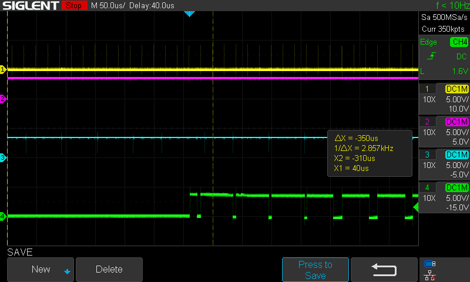

[Back to Main](./readme.md)

# Next Steps

<a id="readme-next-steps"></a>

Using a dedicated cpu core to run either a userspace app or a kernel module can perform the real-time task of reading a data packet every 20us from a 64-packet deep FIFO, but it does so with an error rate of approximately one error per 100,000 packets. I would prefer an error rate closer to one in one billion. What can be done to achieve this goal?

## Bare Metal App

The project in [Bare-Metal](../09-Bare-Metal) can achieve this by eliminating the Linux OS altogether. But this does not properly solve the problem as we lose the benefits of having a full OS at our disposal. Also, the real-time task will ultimately have to re-send gathered data over an ethernet link to a remote computer and this is something we have not yet addressed in all the previous testing. A bare metal app would have to include a TCP/IP stack. The [circle](https://github.com/rsta2/circle) project includes some ethernet capability and other options exist like using an embedded stack such as lwIP (we have 3 more cores to run code). However, even if we embed a stack inside the bare metal app, we still miss out on other nice things provided by an OS. Nevertheless, a bare metal app is an option if it is the only way to achieve the task with the required error rate.

(One special benefit of a bare metal app is security. Not running an operating system eliminates almost any chance of remote malicious users.)

## Deeper FIFO

The Lattice ice40HX4K FPGA on the RPi-FPGA-01 board is not full. It is time to experiment with a deeper FIFO and maybe the full 16-bit wide bus.

## Text Mode

We could simply boot the Raspberry Pi into a text mode console and avoid a graphical UI altogether as it seems like GUI events (redraw requests, overlay planes etc.) associated with X11, and even more so with Wayland, are the main cause of interruptions to our app. 

For a remote real-time system, it would make most sense to NOT run a GUI. Afterall, it makes no sense to allow a user to run a web browser on such a system with a dedicated purpose, but it's an interesting exercise to try and see if we *could* handle worst case scenarios *as well as* maintaining the real-time task. With that in mind, the first paragraph in this document should be modified to say that the task can be performed with an error rate of one in 100,000 *when running the X11 GUI*.

It may be impossible to *prove* that a real-time task would be performant in this situation because we have no control of what Linux *may* decide to do in the background at any time. (Hence, the importance of genuine real-time operating systems that provide certain guarantees.) Does anyone else remember the 90's when you would be running something important on a PC and Windows would decide to de-fragment the hard drive in the background? But it would be nice to run a real-time task with enough assurance that any loss of data would be extremely rare (remember, this task is not truly a *hard* real-time task and can endure some level of failure). A standard Linux kernel, running without a GUI may provide acceptable performance.

## Step One - Text Mode

Of all the variants tested up until this point, based upon what has been learned, I will only use either (1) a userspace app on a dedicated core, or (2) a kernel module (based on a high resolution timer) running on a dedicated core. 

Let's try booting into a text mode console and running some tests. 

Set the scope to trigger on the 'FIFO full' signal and run the userspace app from the '04-UserApp' folder:

```bash
./RPi-FPGA-01 LOOP
```

I start to go to another login console and the scope triggers!

<div align="center">
  <a href="https://github.com/ddommett/RasPi_FPGA">
    
  </a>
</div>

I forgot to have the app run on its own dedicated core! Let's try this test again (at least this verifies that running the app with 'normal' priorities or without a dedicated cpu is insufficient even when NOT in a GUI).

Run the userspace app with:

```bash
taskset -c 3 ./RPi-FPGA-01 LOOP
```

Then CTRL-ALT-F2 to get to another console and login, then run htop:

```bash
htop
```

Then CTRL-ALT-F3 to another console, login, then run stress-ng for one hour:

```bash
nice -20 stress-ng -c 3 --metrics --timeout 3600s
```

Then CTRL-ALT-F4 to another console, login, then run sysbench to stress file IO:

```bash
sysbench --test=fileio --file-total-size=2G prepare
sysbench --test=fileio --file-total-size=2G --file-test-mode=rndrw --max-time=300 --max-requests=1 run
sysbench --test=fileio --file-total-size=2G cleanup
```

After the file IO ended, I ran it again. In fact, each hour, when stress-ng ended, I would restart stress-ng and sysbench. I would look at the cpu activity in htop (CTRL-ALT-F2). The app ran **ALL** day without a single lost packet!

I even modified the code temporarily to print a message every 10 seconds to say how many packets were read and lost. I had previously avoided the printf function because of its impact on performance, but even this caused no errors in a repeat of the test.

One billion data packets equals approximately five and a half hours. This demonstrated the userspace app can achieve the real-time task with the desired error rate!

[Back to Main](./readme.md)
