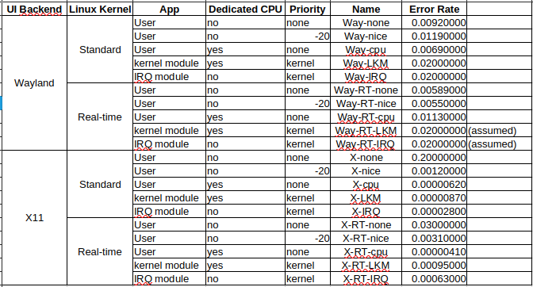
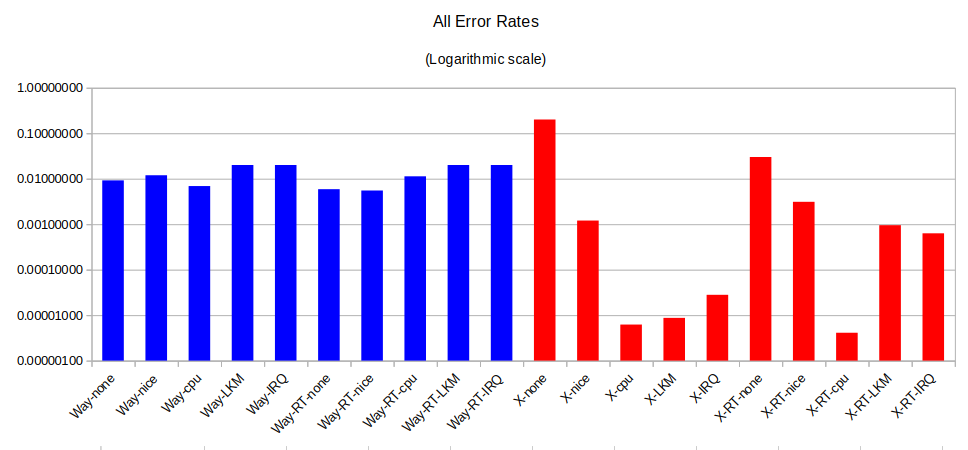

[Back to Main](./readme.md)

# Results

  

  

The chart has to use a logarithmic scale because of some of the results differ by a factor of over one thousand. Even with poor statistical power in the tests, it is reasonable to conclude that using Wayland as a UI backend is problematic. All tests under Wayland performed very poorly regardless of the approach taken (about one error per 100 packets). We can reasonably conclude that different approaches are useful when using X11 as the UI backend (ranging from 1 error in 10 packets, to one error in 100,000 packets).

## Conclusions

The implementation of the Wayland protocol in the Raspberry Pi OS needs improvement; it is currently unsuitable for real-time tasks. The progression of improvement when using X11 is what was expected. 

There was no significant difference between using the standard linux kernel and a "hard" real-time kernel.

When using a linux kernel module, there is no significant difference between an IRQ based approach or using the high resolution timers.

The best results were obtained when using either a userspace app running on a dedicated core, or when using a kernel module on a dedicated core.

Developing a userspace app is simpler than a kernel module.

At an error rate of one error every 100,000 data packets, the best implementations are still inadequate for my task. While I did not state required error rates at the beginning, my goal would be to achieve an error rate as low as one in a billion (1/1,000,000,000). Whether Wayland or X11 is used, it is clear that a graphical UI causes interrupts of sufficient length or frequency that data packets are lost regardless of what is done in software to mitigate the problem.

If the real-time task had a frequency of one millisecond (data packets occurring once every millisecond), a userspace app and the standard Linux kernel would be sufficient to achieve real-time performance. With this task having a time period of 20us, and only a 64-packet deep buffer, I cannot achieve real-time performance (with my desired error rate) using any method tried so far.

[Back to Main](./readme.md) or [Next](./NextSteps.md)
