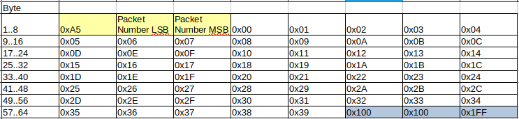
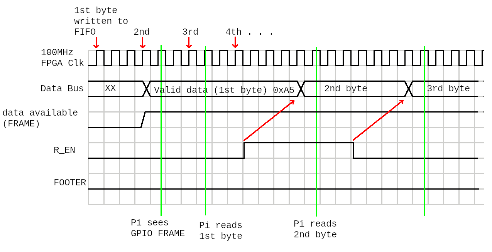
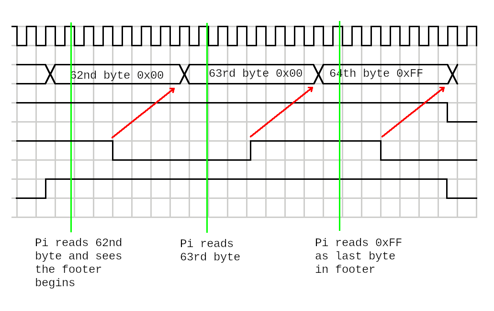
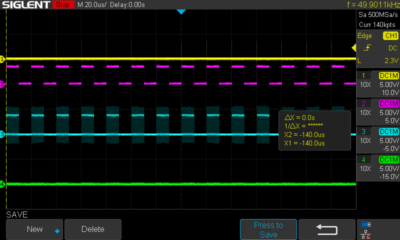
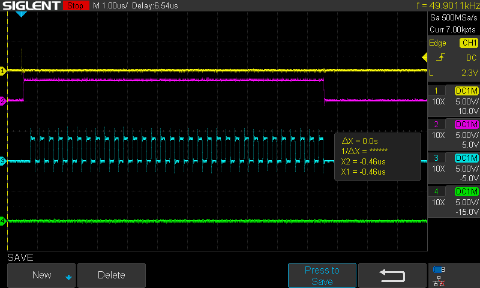
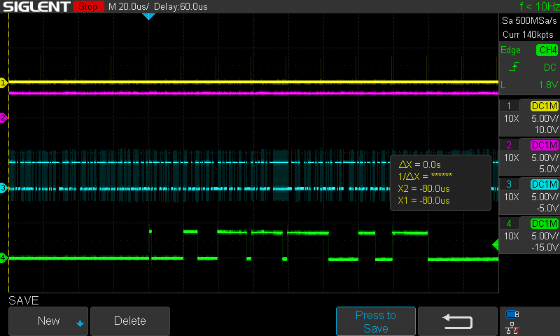
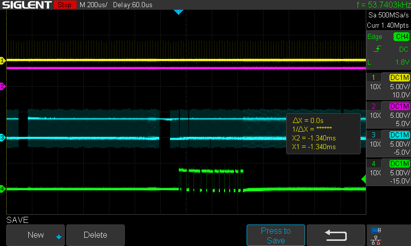
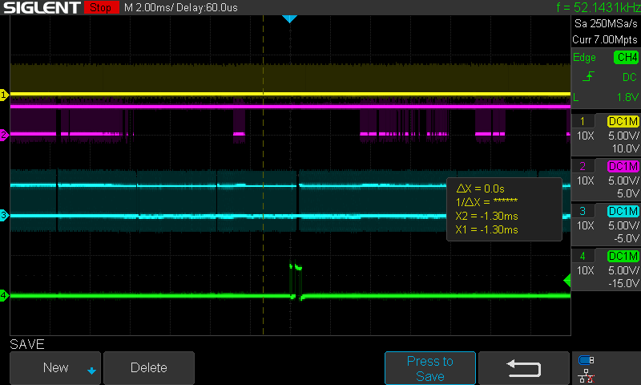
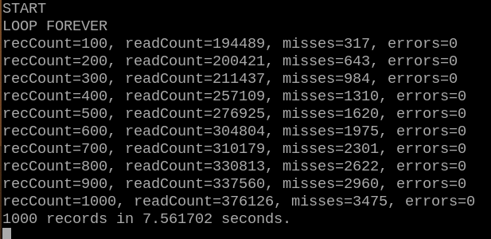
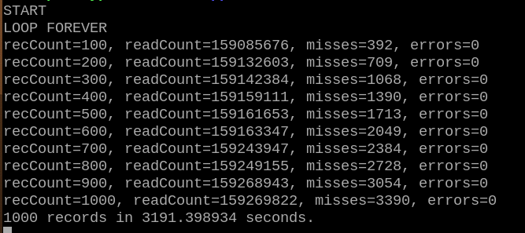

[Back to Main](./readme.md)

# RPi-FPGA-01 Userspace App
<a id="readme-rpi-fpga-01-userspace-app"></a>

This is where the real work begins on evaluating approaches to high performance communication between a Raspberry Pi and an FPGA via a custom GPIO interface. 

Note: these experiments were largely done in January of 2026 and the latest version of Raspberry Pi OS, based on Debian 13 "Trixie" (released October 2025), is the recommended OS. It features Linux Kernel 6.12 and uses the Wayland window manager by default.

The goal, (somewhat arbitrary), is to transfer 100 bytes every 20us from a FPGA into a Raspberry Pi 4 using the RPi-FPGA-01 board with its Lattice ice40HX4K. The intention is to implement an old-fashioned 16-bit wide parallel bus on the GPIO. Data would appear on GPIO 0-15, and since the fpga configuration uses 6 I/O lines, that leaves 6 GPIO that can be used for bus control signals. (More I/O can be gained by re-configuring some of the configuration I/O lines; they can be used once the FPGA is configured and running.)

I'm going to design for a 16-bit wide bus (2 bytes per read cycle). But for the sake of simplicity, I'm going to just use 8-bits and read 64 bytes every 20us. This should be good enough for learning and testing, and I can always turn on the extra 8-bits at the end.

To simulate a set of sensors interfaced to the real world, the FPGA generates a sequence of numbers starting at zero and counting up — this will be the data packet. It also generates a 16-bit "packet number" which will make up part of the data packet. This packet number will increment every 20us. The FPGA program also defines an asynchronous FIFO in its memory blocks. Every 20us, a packet of data will be written into the FIFO, and the FPGA will signal the Raspberry Pi that data is available, and ideally, the Raspberry Pi will read this data every 20us. The FIFO was only could store a maximum of 8 data packets.

I knew this was unlikely to work well because online research had stated that in the **best** of circumstances, the latency of responding to a signal (even if configured as an IRQ) was at least 120us and was commonly 1ms or more. I won't bore anyone with the time spent in the early trials of proving this to myself. The Raspberry Pi 4 missed **many** packets (at least 50%).

The asynchronous FIFO had its depth increased to be 64 packets deep. This meant that the Raspberry Pi 4 could be 'busy' doing other tasks without responding to my FPGA for the length of time of 64 data packets or 64x20us. The task of reading data packets from the FPGA could be interrupted for 1.28ms, and as long as it returned to reading packets quickly enough, no packets would be missed as they would be buffered within the FIFO.

To be clear, when I say the "Raspberry Pi 4" reads or misses data packets, I mean that a C application I wrote is busy continually reading data packets and I am measuring its success or failure. My C application is continually reading data packets immediately as they become available. But the Linux OS, being general purpose and multi-tasking, can interrupt my process as part of its scheduling algorithm and run other tasks — it is these interruptions that cause my C application to miss packets. Linux, running other tasks, puts my application to sleep and must wake it up every 20us to handle the next FPGA data packet, or with a 64 packet deep FIFO buffer, Linux must wake up my application every 1.28ms **AND** allow it to run long enough to empty the FIFO (ideally) while the FPGA is *still* adding packets to the FIFO every 20us.

To allow my C application to run as fast as possible, it manipulates the GPIO registers directly. As such, it manages to read a data packet in approximately 10us (64 words). (This is why the alternative SMI function of the GPIO pins is so lucrative — it is a synchronized parallel bus and can run faster than my asynchronous FIFO which has to be concerned with different 'clock domains'.)

<ins>NOTE</ins>: This is intended to **ONLY** run on a Raspberry Pi 4 (or Pi 400) because it modifies registers directly in the BCM2711 chip to control the GPIO pins.

To minimize time lost in 'handshake' signalling on control lines, and to minimize the number of control lines required, the reading of data from the FIFO occurs as follows:

1) The FPGA writes a packet into the FIFO and asserts a 'data available' control line. The 'data available' signal (called FRAME inside the software and FPGA) goes high whenever the FIFO is 'not empty' which means that as soon as a single word is written to the FIFO, this signal is asserted. The FPGA relies on the fact that the Raspberry Pi reads data out of the FIFO much slower than the FPGA can write into it. Therefore, if the Raspberry Pi starts reading data as soon as there is a single byte written, the FPGA will finish writing a full packet before the Raspberry Pi could ever read the full packet.

2) Upon seeing the 'data available' (FRAME) signal, the Raspberry Pi reads a word and then toggles the 'R_EN' signal.

3) The FPGA sees the R_EN signal has toggled and moves onto the next word in the FIFO.

4) Steps 2 and 3 repeat, and as the Raspberry Pi reads from the GPIO pins, it watches the 'FOOTER' signal. When the FOOTER signal goes high, the Raspberry Pi knows that it has reached the end of the data packet. (The 'data available' signal may still be high indicating more data is still in the FIFO to be read — that's ok.)

5) On seeing the FOOTER signal, the Raspberry Pi logs a data message and then returns back to step 2 to start reading the next packet (if no data is available, it will wait until data becomes available).

Each data packet is 64 bytes in size, and here is what a data packet looks like:

<div align="center">
  <a href="https://github.com/ddommett/RasPi_FPGA">
    
  </a>
</div>

The data packet consists of a 3-byte header, 58 bytes of data, and a 3-byte footer. The yellow data fields are a header (0xA5 and a rolling 16-bit packet number) and the light blue bytes at the end are a footer. Note that the footer 'bytes' are 9 bits wide with the MSB bit set. This ninth bit is actually the FOOTER signal; it is encoded into the data in the FIFO. The FIFO is actually 9 bits wide — 1 byte plus this FOOTER bit. The code which generates the 'dummy' data also generates the FOOTER bit to separate packets. 

<div align="center">
  <a href="https://github.com/ddommett/RasPi_FPGA">
    
  </a>
</div>

<div align="center">
  <a href="https://github.com/ddommett/RasPi_FPGA">
    
  </a>
</div>

To make the .bin file for the FPGA, and the C app (from the folder where the Raspi_FPGA project is installed):

```bash
cd 03-RPi-FPGA-01-FIFO
make
cd ..
cd 04-UserApp
make
```

To program the FPGA (make sure the RPi-FPGA-01 board is connected to the Raspberry Pi 4):

```bash 
./RPi-FPGA-01 PROG
```

To run the program and read data packets from the FPGA:

```bash 
./RPi-FPGA-01 LOOP
```

For the purposes of this test, the C application will try to read data packets continuously. Each time it encounters an erroneous situation, it will count an error. Every time it reads a packet successfully, it will compare the rolling packet number with the last packet number to determine if it has missed any interrum data packets, and if so, will count the number of missed packets. It will also keep track of the number of data packets it has read (or attempted to read) in total. 

It is a little difficult to watch the progress of the application because of the time requirements. It is necessary to connect a scope to various electrical signals, but that does not easily show packet reading success or failure. 

The common approach of printing information to the terminal interferes with the timing. The printf function is notoriously slow for time-critical operations due to its complexity, therefore the code avoids using printf to show status as much as possible. It keeps track of all missed packets and statistics in variables and only prints an update to the screen every 100 failures. After 1000 failures, it will print a record of all 1000 errors to a file, and print the time taken and total statistics to the terminal. (Calling printf often causes missed packets because the printf function doesn't even return in time for the code to successfully read another packet in 20us.) In this way, we have a crude approach of measuring how much time it takes for 1000 failures to occur.

Let's take a look at some timing images on the scope as the software runs with the FPGA.

<div align="center">
  <a href="https://github.com/ddommett/RasPi_FPGA">
    
  </a>
</div>

The yellow channel #1 shows a pulse every 20us. (It's a little difficult to see because the pulses line up with the gray grid of the scope background.) This pulse occurs as the FPGA starts to write a data packet into the FIFO.

The magenta channel #2 shows a wider pulse occurring every 20us. This is the 'data available' (or FRAME) signal indicating to the Raspberry Pi that data is available to read.

The cyan channel #2 shows a group of pulses occurring during the magenta pulse. This is the R_EN signal toggling as each byte is read from the FIFO.

Everything looks quite good here, the application must be nicely waiting because every 20us it is immediately reading the packet out of the FIFO. The fact that the 'data available' signal returns to 0 before the next 20us pulse means that the FIFO is completely empty. The Raspberry Pi is keeping up with the data! At 64 bytes every 20uS, that is 3.2M Bytes per second (could be 6.4MB/s if I used the full 16-bits.)

Let's zoom in on the signals for clarity:

<div align="center">
  <a href="https://github.com/ddommett/RasPi_FPGA">
    
  </a>
</div>

Now it is easier to see the yellow pulse, and the 'data available' (magenta) pulse is long enough that we can see each individual toggle of the R_EN signal (cyan). This represents reading one whole data packet of 64 bytes. You can see that the 'data available' (magenta) signal rises slightly after the yellow pulse as the first byte is written into the FIFO. The Raspberry Pi must have been waiting and very quickly starts reading bytes and toggling the R_EN signal. Note that it takes approximately 10us for a full buffer to be read.

Now we're going to zoom out on the timing and look at what happens when there is some user activity occurring in other tasks (in this case, scrolling a gvim editor window).

<div align="center">
  <a href="https://github.com/ddommett/RasPi_FPGA">
    
  </a>
</div>

The yellow pulses are still there every 20us, but we have caught a moment in time where the 'data available' (magenta) signal is not toggling — it is staying high. The R_EN signal is toggling continually, and worst of all, the green channel #4 is now showing some pulses. The green channel #4 is connected to a 'FIFO full' signal. When this signal goes high, we will lose packets and miss data. This is not good!

In order to multi-task, and to handle the action of scrolling in another application window, Linux has interrupted my C app to handle other tasks. These interruptions have occurred often enough, and/or for long enough time periods, that the FIFO filled up with 64 packets before my C app was given CPU time to do its work. This is what causes lost data in the FPGA data stream!

We zoom out further in time (a factor of 10):

<div align="center">
  <a href="https://github.com/ddommett/RasPi_FPGA">
    
  </a>
</div>

We can see that there are gaps in the R_EN signal toggling (cyan). This probably means that the C app is completely asleep during those gaps. When given time, it does its best to empty the FIFO but ultimately fails as the green 'FIFO full' signal shows.

We zoom out further in time (another factor of 10):

<div align="center">
  <a href="https://github.com/ddommett/RasPi_FPGA">
    
  </a>
</div>

We can see that sometimes the FIFO gets emptied, and sometimes not. But ultimately, those green pulses show that the C app does not keep with the data stream from the FPGA as long as there is activity by scrolling another window on Linux. Scrolling a window is light activity. We haven't really created a heavy load on the system yet and already we are losing data.

So let's get some crude measurement of the error rates (missed data packets). I start the C app running, and then a gvim editor window is scrolled to simulate light user activity.

<div align="center">
  <a href="https://github.com/ddommett/RasPi_FPGA">
    
  </a>
</div>

After about seven seconds, it has recorded 1000 failures. In 376,126 packets, it has missed 3,475 — an error rate of 0.92%.

Let's repeat the same test, but this time, I will not create any extra user activity.

<div align="center">
  <a href="https://github.com/ddommett/RasPi_FPGA">
    
  </a>
</div>

After 53 minutes, and seeing no failures, I deliberately created user activity to cause failures and trip the app into reporting the number of packets it had read. With 3390 missed packets out of 159,085,676 packets, it had an error rate of 0.00213%. Most likely, I had caused most of these failures by trying to get it to quit, so it probably had an error rate of 0% during the 53 minutes of no other activity.

We really are starting to see that Linux is not a real-time operating system (at least in a standard installation). One possible solution is to increase the depth of the FIFO to 128, 256, 512, or 1024 packets. The Lattice ice40HX4K has more logic available, but I'm going to stick with a 64 deep FIFO while I continue to experiment. 

So, we can read data at a rate of 3.2MB/s. With a light load, we can expect Linux to cause our data stream application to produce an error rate of 0.92% and I wouldn't be surprised if this grew to an error rate of 50% if we created a heavy CPU load on the system.

A Raspberry Pi has 4 CPU cores clocked at 1.8GHz, so why can't we keep up with 3.2MB/s communication? What else might we be able to do to improve the performance of the C app under Linux?

## 'Nice' Priority

Processes on Linux have a 'priority' level. Some can be designated to run at high or low priority with the 'nice' command when starting the application.

```bash
sudo nice -n -20 ./RPi-FPGA-01 LOOP
```

With a 'light' cpu load of scrolling a gvim editor window, the app missed 3254 out of 273,472 packets - an error rate of 1.19%. But with no cpu load it missed 324 out of 431,768,125 packets — an error rate of 0.000075%.

**Note**: As I observed no errors occurring when there was no user activity (no cpu load), I would let it run for an hour or more (even overnight sometimes) and then I would trigger errors by scrolling a window to get it to quit and show some information. So, for this and all future tests of 'no cpu load' a figure of 0.000075% or 0.00478% could be assumed to be zero. 

**Note**: My tests are limited, I'm not really performing multiple tests under the same circumstances, nor am I really providing a 'repeatable' load on the CPU, so we have to remember that I am using a sample size of one and the experiment is not fully scientific. However, it is sufficient to see that there is a significant difference between 'no load' and 'light load'

Using 'nice' to increase priority is not significantly different to the situation in where the application is just run with a standard priority.

## Isolated CPU Core

Remember, we have **4** cores! What if we dedicate one core to our C app and let the OS use the other 3 cores for anything else? (Prior online research states that this is of little help because the Linux scheduler is very good at what it does, and isolating a process makes little improvement, but let's try it and see it for ourselves.)

The cores are numbered from 0 to 3; we'll try to dedicate core 3 to our purpose. What we want to do is tell Linux to run **nothing** else on core 3, and then tell it to run the RPi-FPGA-01 app on core 3. Ideally, core 3 will continually read packets from the FPGA without interruption, while all sorts of things can run on the other cores. This should be great right?

To tell Linux to isolate core 3 from the scheduler: add the text 'isolcpus=3' to the command line in the file '/boot/firmware/cmdline.txt' and then reboot. To verify that this took the desired effect:

```bash
cat /sys/devices/system/cpu/isolated
```

Now, use taskset to specify running the C app on core 3:

```bash
taskset -c 3 ./RPi-FPGA-01 LOOP
```

Under a light load, the error rate was 0.69%. Under no load, the app was stopped artificially and reported an error rate of 0.000093% (as stated above, this is probably 0). While 0.69% *looks* better than the 1.19% when changing the priority, given my testing methods, there really is no significant difference.

So, running on an isolated CPU core also made no significant difference. (Which is a pity because you would think it really ought to!)

## Build a Real-time Kernel

Well how about we run with a "real-time" Linux kernel? (You couldn't do this in the early days of Linux, and later you could by applying the PREEMPT_RT patch with some difficulty, but now it's quite easy to try.) Surely that should help our C app run with more predictable timing?

To build the Linux kernel and enable the real-time features:

```bash
git clone --depth=1 https://github.com/raspberrypi/linux
sudo apt install bc bison flex libssl-dev make
cd linux
KERNEL=kernel8
make bcm2711_defconfig
```

Change the line in .config: CONFIG_LOCALVERSION="-MY_CUSTOM_KERNEL"

```bash
sudo apt install libncurses5-dev
make menuconfig
```

The 'make menuconfig' will start a text-based configuration program, and this is where we actually set parameters to enable the real-time features before we build the kernel. Under 'General Setup' make the kernel 'fully pre-emptible' (real-time). Then go to the sub-category 'Timers' and make it 'tickless' (CONFIG_NO_HZ_FULL=y). (This could also be done by manually editing the .config file.)

Then, make the kernel (takes a long time on a Raspberry Pi 400 but saves having to cross-compile):

```bash
make -j6 Image.gz modules dtbs
```

Then install the modules, backup the old kernel, copy the new kernel and overlays:

```bash
sudo make -j6 modules_install
sudo cp /boot/firmware/$KERNEL.img /boot/firmware/${KERNEL}_backup.img
sudo cp arch/arm64/boot/Image.gz /boot/firmware/$KERNEL.img
sudo cp arch/arm64/boot/dts/broadcom/*.dtb /boot/firmware/
sudo cp arch/arm64/boot/dts/broadcom/*.dtb* /boot/firmware/overlays/
sudo cp arch/arm64/boot/dts/broadcom/README /boot/firmware/overlays/
```

Now reboot and the system will be running the new 'real-time' kernel!

## Testing with Real-time Kernel

### Base

With a light load, 3805 packets out of 645,799 were missed, which gave an error rate of 0.589%. Under no load (again stopped artificially) it reported an error rate of 0.00478%. These results are very similar to all the tests done with the standard kernel.

### Nice priority

Using the 'nice' command to increase the priority to maximum gave an error rate of 0.55% with light load, and 0.00186% under no load. Again, these results are not significantly different to the standard kernel.

### Isolated Core

Isolating the application to core 3 (and configuring the Linux scheduler to NOT run anything else on core 3) gave an error rate of 1.13% under light load and 0.00029% with no load. Also, these results are roughly the same as for the standard kernel.

### Extra Real-time Kernel Parameters

In contrast to a 'standard' Linux kernel, a real-time kernel can be affected by a few more parameters.

It is possible to configure the real-time scheduling policy and priority of a process once it is running. This is done with the chrt command and you have to find the process ID of your running process first. This following command will set it to 'SCHED_FIFO', level 99 - the highest.

```bash
sudo chrt -f --pid 99 <pid>
```

'Real-time scheduling' also affects processes and to turn it off you can do:

```bash
sudo sysctl kernel.sched_rt_runtime_us=-1
```

And then there are some more options to add the the boot command in /boot/firmware/cmdline.txt:

```bash
nohz=on nohz_full=3 rcu_nocbs=3 irqaffinity=0
```

We do all these things to try and avoid interrupting the process as it runs on core 3.

Let's repeat the tests.

With light load, error rate = 0.45% and with no load, 0.000083%.

## Conclusion

We have tried combinations of process priority, cpu isolation, real-time kernel, and optimized real-time configurations. Nothing has significantly improved on running a user application with 'normal' priority on a 'standard' Linux kernel. The only way to transfer data from the FPGA to the Raspberry Pi without missing data is to make sure we don't do anything else on the system. (Even then, we haven't *proven* that this holds true ALL the time, 24 hours a day, in spite of ethernet activity, kernel maintenance tasks etc.)


[Back to Main](./readme.md) or [Next](./FastGpioBus.md)

