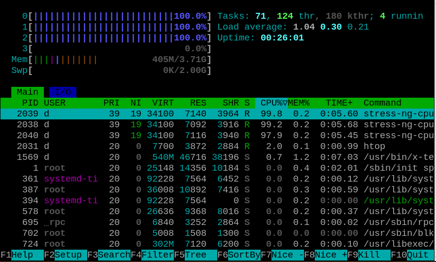
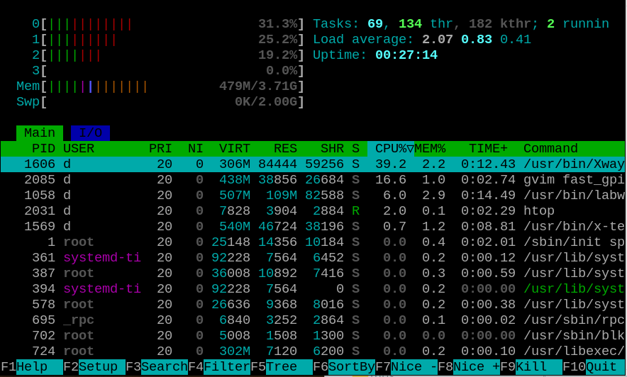

[Back to Main](./readme.md)

# Heavy CPU Load and a Revelation

<a id="readme-heavy-load"></a>

So I think I've tried everything and nothing keeps up with real-time data transfer from the FPGA if a user is doing anything as simple as scrolling the mouse in an editor window.

I'm curious though, maybe I'll see a difference between the userspace app and kernel driver under a heavy load?

## CPU load

I installed the 'stress-ng' package to create a heavy CPU load. I set up the scope to trigger on the 'FIFO full' signal, and I run 'htop' in a separate window (see image) to watch the cpu activity. I run the high resolution timer version of the kernel module while executing stress-ng with the following command:

```bash
nice -19 stress-ng -c 3 --metrics --timeout 30s
```

<div align="center">
  <a href="https://github.com/ddommett/RasPi_FPGA">
    
  </a>
</div>

You can see that the 3 cores available to Linux are 100% busy. The 4th core is dedicated to my timer routine (due to the way htop works, kernel cpu activity is not monitored so it looks like it is doing nothing but it **is** busy reading packets).

However, the scope NEVER triggers. The FIFO full signal is NEVER activated! Isn't that odd? Afterall, here is an image of cpu activity when scrolling the mouse:

<div align="center">
  <a href="https://github.com/ddommett/RasPi_FPGA">
    
  </a>
</div>


A heavy cpu load such does NOT slow down my kernel module.

## Memory Stress test

Maybe memory is the problem. While running the high resolution timer kernel module, I test memory with sysbench:

```bash
sysbench --test=memory --memory-total-size=2G
sysbench --test=memory --memory-total-size=2G --memory-oper=read
```

The scope NEVER triggers. 

## IO Stress Test

While running the high resolution timer kernel module, I test file IO with sysbench:

```bash
sysbench --test=fileio --file-total-size=2G prepare
sysbench --test=fileio --file-total-size=2G --file-test-mode=rndrw --max-time=300 --max-requests=1 run
sysbench --test=fileio --file-total-size=2G cleanup
```

The scope DID trigger on the 'FIFO full' signal a few times during the preparation phase, so IO operations *can* upset my kernel module, but considering how long the IO benchmark took to run and it only triggered a few failures, why does scrolling a mouse cause instant failures so easily?

# GPU Stress Test

I downloaded GeeXLab 0.66.1 to test GPU load. 

This is where I got a bit lucky, or unlucky depending on how to view the circumstance, and had one of those 'Euraka' moments. GeeXLab would run, but it wouldn't run any of the demos it comes with (the demos create the GPU load). Online reading suggested that if an app won't work under Wayland, try switching back to X11. (To maintain compatibility, Wayland includes 'XWayland' and when an app has not yet been built to run natively under Wayland, XWayland provides a compatibility layer.) Remember, way back in [UserApp](./UserApp.md), I briefly mention that the current version of Raspberry Pi uses Wayland? 

So I use raspi-config to configure my Raspberry Pi OS to use X11 and I reboot.

Under X11, GeeXLab is now quite happy to run numerous graphics demos to load the gpu system. But still, the scope NEVER triggers under this circumstance!

# Eureka!

Aside from file IO causing *some* missed packets, I've tried all sorts of testbench software to load the Raspberry Pi and none of them cause problems like scrolling a text editor window.

So, while GeeXLab is running, I scroll a window just to see it cause failures. But the scope did NOT trigger. That's definitely curious!

I leave GeeXLab running (spinning 3D gears, showing particle/fire effects etc.). I open another terminal window to run htop, and I run stress-ng again to load the cpus. I start scrolling the window and *still* the scope did NOT trigger.

Switching from Wayland to X11 made a **huge** difference for my task!

(In fact, heavily using the GUI, like moving and scrolling windows *could* still trigger the scope under X11, but it was a LOT more difficult to trigger a failure.)

It is now time to repeat the previous tests under X11.

[Back to Main](./readme.md) or [Next](X11-UserApp.md)
