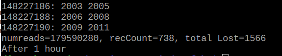
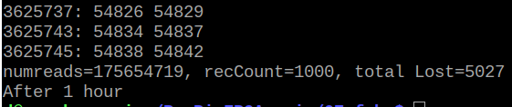
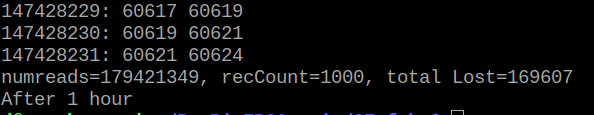
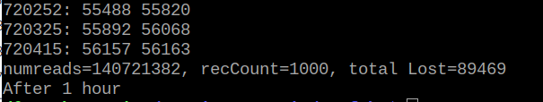

[Back to Main](./readme.md)

# Fast GPIO Bus with X11

<a id="readme-fast-gpio-bus-x11"></a>

Let's test the 'Fast-GPIO-Bus' kernel module with X11. Refer back to [Fast GPIO Bus](./FastGpioBus.md) for more details.

Build and install the device tree overlay:

```bash
cd 05-Device-Tree-Overlay
make
sudo dtoverlay fast_gpio_bus_overlay.dtbo
```

Build and install the kernel driver:

```bash
cd 06-LKM-Fast_GPIO-Bus
make
sudo insmod fast_gpio_bus.ko
```

Build the app:

```bash
cd 07-fgb
make
```

## Kernel Module - High-Resolution Timer based Fast GPIO Bus

```bash
./fgb START
./fgb READ1HOUR
sudo rmmod fast_gpio_bus.ko
```

The READ1HOUR command will read from the kernel module /proc/fast-gpio-bus file until the ring buffer is empty, then it will loop for one hour, continually reading packets from the kernel module, then it will report the number of packets read and lost.

Note: All tests were done with GeeXLab running the NanoVG demo and with stress-ng hogging 3 cpus for one hour. By triggering the scope on the 'FIFO full' signal, it was verified that lost packets were due to the communications with the FPGA being interrupted (not the ring buffer in the kernel module filling up).

Here is an example of fgb running in the terminal:

<div align="center">
  <a href="https://github.com/ddommett/RasPi_FPGA">
    
  </a>
</div>

It read 179,590,280 packets and lost 1,566 packets. This is an error rate of 0.00087%, which is not significantly different from the user app running on an dedicated core (this kernel module thread is also running on a dedicated core). It is a little disappointing to go through the effort of building a kernel module, device tree, etc. and not see any significant benefit.

## Kernel Module - IRQ based Fast GPIO Bus

A kernel module based upon a high resolution timer did not seem to help. Let's try the IRQ based kernel module.

```bash
cd 08-LKM-IRQ
make
sudo insmod fast_gpio_bus.ko
cd ..
cd 07-fgb
./fgb START
./fgb READ1HOUR
sudo rmmod fast_gpio_bus.ko
```

<div align="center">
  <a href="https://github.com/ddommett/RasPi_FPGA">
    
  </a>
</div>

It read 175,645,719 packets and lost 5,027 packets. This is an error rate of 0.0028%, which is not significantly different from the non-IRQ kernel module.

## Real-time Kernel with High-Resolution Timer based Fast GPIO Bus

Let's repeat these tests while running the real-time kernel.

<div align="center">
  <a href="https://github.com/ddommett/RasPi_FPGA">
    
  </a>
</div>

It read 179,421,349 packets and lost 169,607 packets. This is an error rate of 0.095%.

## Real-time Kernel with IRQ based Fast GPIO Bus

<div align="center">
  <a href="https://github.com/ddommett/RasPi_FPGA">
    
  </a>
</div>

It read 140,721,382 packets and lost 89,469 packets. This is an error rate of 0.063%.

It would appear that the real-time Linux kernel is about 10 times worse than the standard Linux kernel! (At least for this real-time task.) Perhaps my custom real-time kernel is missing some important configuration? The standard kernel **is** a pre-emptible kernel which is supposed to improve its performance for *soft* real-time, whereas the custom real-time kernel was built to be pre-emptible and perform for *hard* real-time tasks.

[Back to Main](./readme.md) or [Next](./OverallResults.md)
