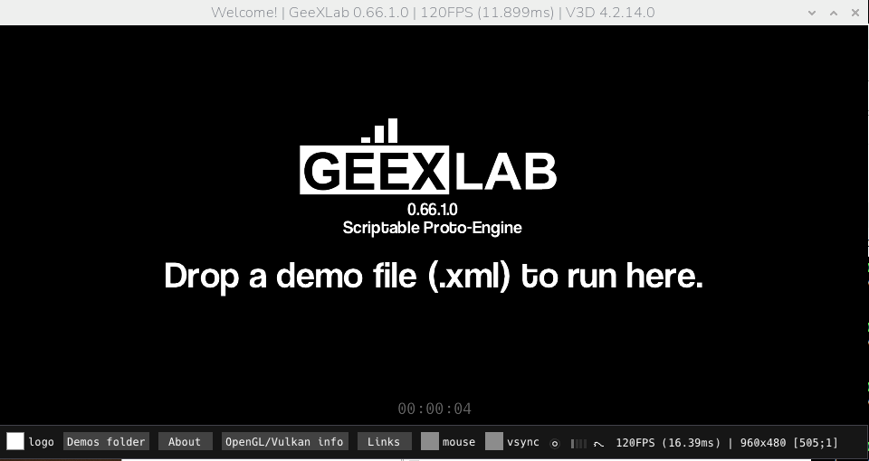
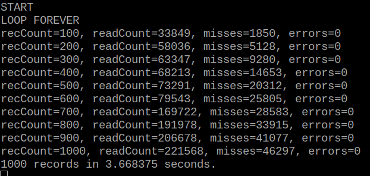
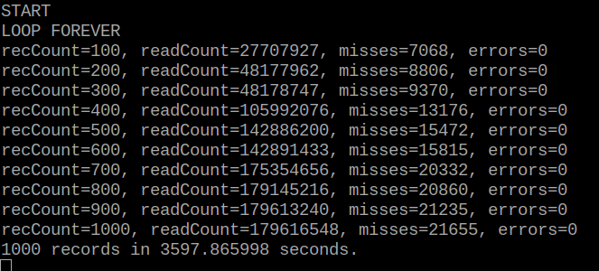
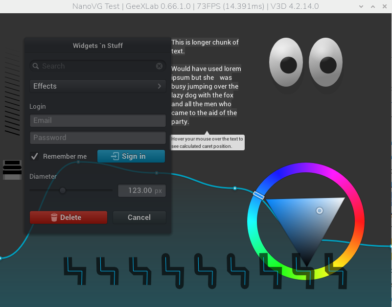
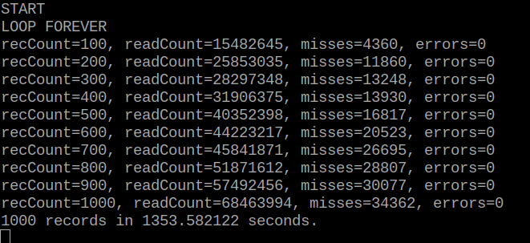
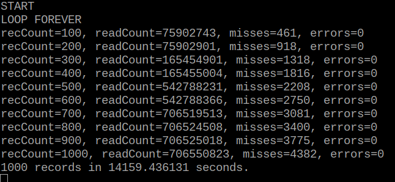
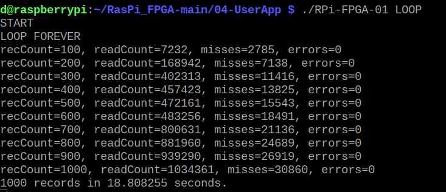
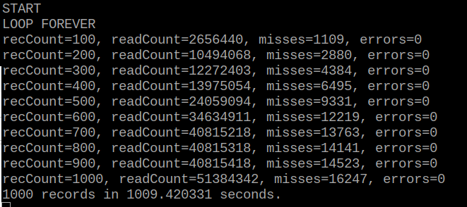
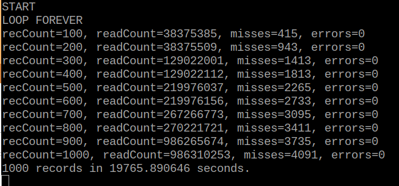

[Back to Main](./readme.md)

# RPi-FPGA-01 X11 Userspace App
<a id="readme-rpi-fpga-01-x11-userspace-app"></a>

With the Raspberry Pi 4 using X11, the past tests shall be repeated. This time, stress-ng and GeeXLab will be included to load the cpu and gpu while the userspace app reads packets from the FPGA.

(These instructions, and the app itself is explained in more detail in the previous document [UserApp](./UserApp.md))

## Standard User App

To make the .bin file for the FPGA, and the userspace C application (from the folder where the Raspi_FPGA project is installed):

```bash
cd 03-RPi-FPGA-01-FIFO
make
cd ..
cd 04-UserApp
make
```

To program the FPGA (make sure the RPi-FPGA-01 board is connected to the Raspberry Pi 4):

```bash 
./RPi-FPGA-01 PROG
```

To run the program and read data packets from the FPGA:

```bash 
./RPi-FPGA-01 LOOP
```

RPi-FPGA-01 ran simultaneously with the GeeXLab software. The GeeXLab remained in its default state (no demo loade) which shows an animated logo:

<div align="center">
  <a href="https://github.com/ddommett/RasPi_FPGA">
    
  </a>
</div>

The mouse was wiggled continually — wide circles over the whole screen because this seemed to cause problems quickly . The following image shows that it only took 3.6 seconds for the userspace app to record 1000 failures. It lost 46,297 packets in 221,568 which is almost a 20.9% error rate!

<div align="center">
  <a href="https://github.com/ddommett/RasPi_FPGA">
    
  </a>
</div>

## Nice priority

Let's run the same test, but increase the priority of the user app with the 'nice' utility:

```bash
sudo nice -n -20 ./RPi-FPGA-01 LOOP
```

<div align="center">
  <a href="https://github.com/ddommett/RasPi_FPGA">
    
  </a>
</div>

It ran for an hour, and with 21,655 lost packets in 179,616,548 packets, that is an error rate of 0.012%. (I could see it was not getting many failures, so I started to do some file editing on the Raspberry Pi to hurry it along! So yes, not a pure scientific test.)

The next image is what the GeeXLab software looks like when it is running a demo called 'NanoVG'. There is a lot more graphical activity occurring, keeping the gpu busy.

<div align="center">
  <a href="https://github.com/ddommett/RasPi_FPGA">
    
  </a>
</div>

The same test was repeated with the user app at a nice priority of -20, with the NanoVG demo loaded in GeeXLab, and stress-ng was run to place a heavy load on the cpus at the same time with:

```bash
nice -20 stress-ng -c 3 --metrics --timeout 300s
```

<div align="center">
  <a href="https://github.com/ddommett/RasPi_FPGA">
    
  </a>
</div>

With 16021 lost packets in 121,965,455 packets, this gave an error rate of 0.013% (and took approx 40 minutes).

Regardless of whether GeeXLab is running a demo or not, using a 'nice' priority of -20 provides an improvement in the error rate that is approximately 100 times better than standard priority. This is **MUCH** improved. The 'nice' priority **DOES** make a difference.  

## Isolated CPU Core

Let's try running the user app on its own dedicated cpu. Follow the same as before (see [UserApp](./UserApp.md) for a complete explanation and details). 

To tell Linux to isolate core 3 from the scheduler: add the text 'isolcpus=3' to the command line in the file '/boot/firmware/cmdline.txt' and then reboot. To verify that this took the desired effect:

```bash
cat /sys/devices/system/cpu/isolated
```

Now, use taskset to specify running the C app on core 3:

```bash
taskset -c 3 ./RPi-FPGA-01 LOOP
```

This really took a long time as can be seen in the following image (nearly 4 hours before it recorded 1000 failures). GeeXLab was running with the NanoVG demo, and stress-ng was running.

<div align="center">
  <a href="https://github.com/ddommett/RasPi_FPGA">
    
  </a>
</div>

After 4 hours, it had lost 4382 packets out of 706,550,823 packets, which gives an error rate of 0.00062%. This is **MUCH** improved over the 'nice' priority. A dedicated cpu **DOES** make a difference!

Here are the error rate results so far when the gpu system is loaded (approximate figures):

Standard user app: 20%

User App with nice priority of -20: 0.01%

User App on dedicated cpu: 0.0006%

The dedicated cpu improves performance by a factor of 10,000! Now we really are getting somewhere!

## Real-time Kernel

What if we experiment with a real-time kernel again? (These tests include the extra real-time parameters documented towards the end of [UserApp](./UserApp.md).)

### Standard User App

When running the user app at a standard priority simultaneously with GeeXLab (no demo loaded), the following image shows that it only took 18 seconds for the User App to record 1000 failures. It lost 30,860 packets in 1,034361 which is almost a 3% error rate!

<div align="center">
  <a href="https://github.com/ddommett/RasPi_FPGA">
    
  </a>
</div>

### Nice priority

Let's run the same test, but increase the priority of the user app with the 'nice' utility

```bash
sudo nice -n -20 ./RPi-FPGA-01 LOOP
```

<div align="center">
  <a href="https://github.com/ddommett/RasPi_FPGA">
    
  </a>
</div>

This time, it ran for 16.8 minutes before it accumulated 1000 records. With 16,247 packets lost out of 51,384,342, this was an error rate of approximately 0.031%. This is **MUCH** improved. Again, the 'nice' priority **DOES** make a difference.  

The same test was repeated with the user app at a nice priority of -20 (NanoVG demo was loaded in GeeXLab and stress-ng was running).

<div align="center">
  <a href="https://github.com/ddommett/RasPi_FPGA">
    
  </a>
</div>

With 34,362 lost data packets out of 68,463,994 packets this was an error rate of 0.05% (approximately the same as the test when no demo was loaded into GeeXLab).

### Isolated CPU Core

Let's try running the user app on its own dedicated cpu (while running NanoVG in GeeXLab and stress-ng). Follow the same as before: 

```bash
taskset -c 3 ./RPi-FPGA-01 LOOP
```

<div align="center">
  <a href="https://github.com/ddommett/RasPi_FPGA">
    
  </a>
</div>

With 4091 lost packets out of 986,310,253 packets, this was an error rate of  0.00041%.

Here are the error rate results with a real-time kernel when the gpu system is loaded (approximate figures):

Standard user app: 3%

User App with nice priority of -20: 0.03%

User App on dedicated cpu: 0.0004%

## Conclusion

We have tried combinations of process priority, cpu isolation, and real-time kernel with optimized real-time configurations while using X11 as the GUI backend. 

Running a standard priority app loses about one packet per 30 packets.

Running a user app at a higher priority improves the error rate significantly (x100). This is about one packet lost per 3000.

Running a user app on a dedicated cpu core improves the error rate significantly (x10,000). This is about one packet lost per 250,000 packets. 

There was no significant difference between running a standard linux kernel and a real-time kernel.


[Back to Main](./readme.md) or [Next](./X11-FastGpioBus.md)

