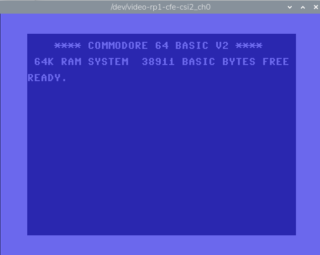

# Capturing HDMI Video on Raspberry Pi 5

[Back to Main Part 2](../readme.md)

## C790 at 720p

I decided to use the [Geekworm C790 HDMI-to-CSI2](https://geekworm.com/products/c790?) module for $30 to capture video. The resolution of the video I want to use is 720p (1280x720) and 480p (640x480). Unfortunately, connecting a C790 is NOT plug-n-play. In this document, I will show an approach to capturing video from a Commodore 64 Ultra running at 720p by downloading and using a few scripts.

This [LINK](./HDMI2CSI.md) provides a long explanation of the commands in the scripts and what they do.

## Connect the C790

With power off, connect the C790 to CAM/DISP1 on the Pi 5 (the camera connector closest to the HDMI connectors). Then connect a video source to the HDMI connector on the C790. (I used a Commodore 64 Ultimate, which was outputting a 720p HDMI resolution.) Boot the Pi 5.

## Specify Linux OS Overlays

Add two lines to the end of the boot config.txt file:

```
sudo sed -i '$a\dtoverlay=tc358743,4lane=1 ' /boot/firmware/config.txt 
sudo sed -i '$a\dtoverlay=tc358743-audio ' /boot/firmware/config.txt 
```

Reboot!

## Download and Run Scripts

Download the HDMI-CSI2 folder. In this folder are three files to use: 80-video.rules, 720p60edid.txt, and C790-720p.

Copy 80-video.rules to /etc/udev/rules.d:

```
cd HDMI-CSI2
sudo cp 80-video.rules /etc/udev/rules.d
```

Command the OS to load the new udev rules (or reboot):

```
sudo udevadm control --reload-rules
sudo udevadm trigger
```

## Configure for 720p (1280x720)

Configure the C790 (and Video4Linux2) to handle 720p video input:

```
chmod 777 C790-720p
```

You MUST have a source 1280x720p video input BEFORE actually running the script, so connect a source before trying this:

```
./C790-720p
```

## Capture Video

Again, the video source MUST be connected before trying the following.

```
ffplay -f v4l2 -input_format bgr24 -video_size 1280x720 -framerate 60 -i /dev/video0
```

<div align="center">
  <a href="https://github.com/ddommett/RasPi_FPGA2">
    
  </a>
</div>

When live, the cursor blinks!

## Configure for 480p (640x480)

Configure the C790 (and Video4Linux2) to handle 640x480p video input (commonly 480p is 720x480 but I'm using 640x480):

```
chmod 777 C790-640x480p
```

You MUST have a source 640x480 video input BEFORE actually running the script, so connect a source before trying this:

```
./C790-640x480p
```

## Capture Video

Again, the video source MUST be connected before trying the following. (I used a Commodore 64 Ultimate, which was outputting a 640x480p HDMI resolution.) The next section [Icepi-Zero-HDMI-640x480](./Icepi-Zero-HDMI-640x480.md) talks about using the Icepi Zero FPGA to generate a 640x480 HDMI signal, so if you don't have a source of 640x480 HDMI, go to the next section and configure the Icepi Zero, then come back here and run the above C790-640x480p script followed by the following ffplay command.

```
ffplay -f v4l2 -input_format bgr24 -video_size 640x480 -framerate 60 -i /dev/video0
```

<div align="center">
  <a href="https://github.com/ddommett/RasPi_FPGA2">
    
  </a>
</div>

Again, this [LINK](./HDMI2CSI.md) provides a long explanation of the commands in the scripts and what they do.

[Back to Main Part 2](../readme.md)
