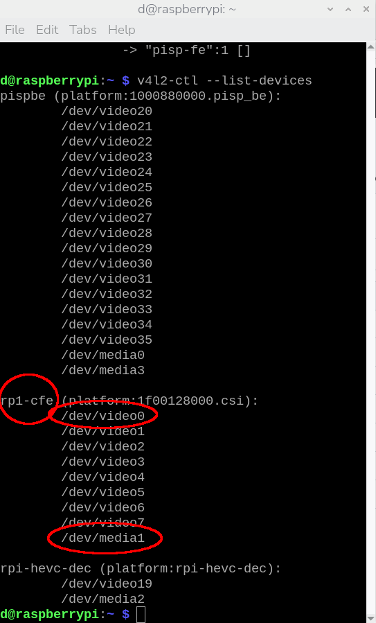
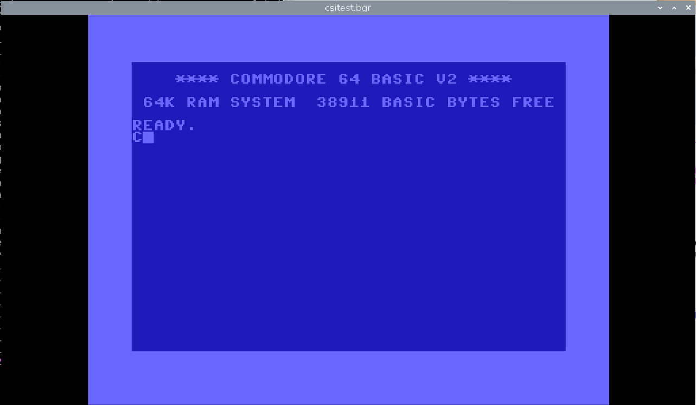
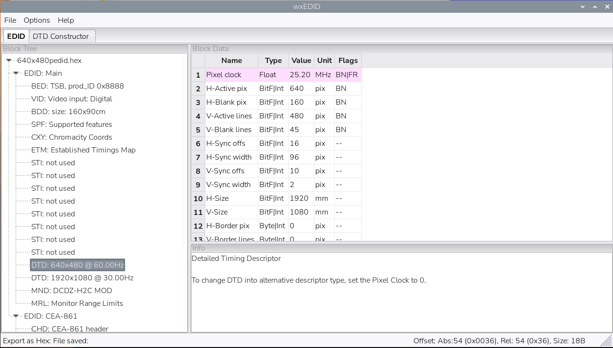
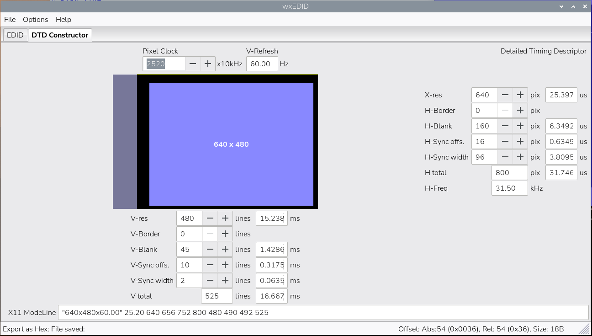
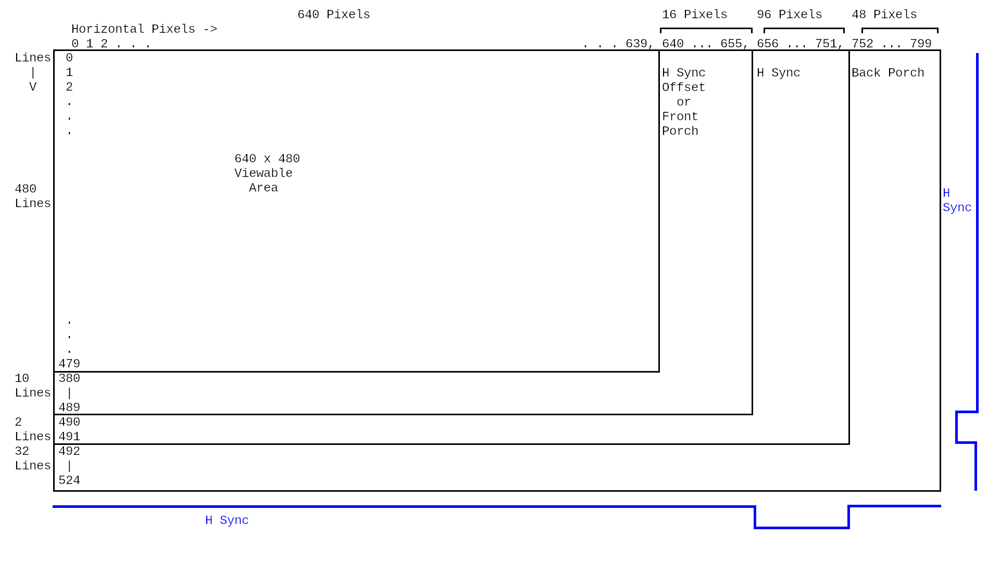

# Capturing HDMI Video on Raspberry Pi 5 - A Long Explanation

In this [LINK](./HDMI2CSI-Start.md), I provide a very quick method to capture video from a 720p HDMI source using pre-written scripts. This document provides a longer explanation of the process, the commands, and what it all means.

Connecting a C790 is NOT plug-n-play, the user is required to enter a number of commands and have knowledge of the intended input resolution. The C790 is an HDMI-to-CSI bridge, not a native camera. It is not accessible through libcamera and therefore the common "rpicam-apps" available in the OS for a Pi 5 cannot be used. Instead, we must use Video4Linux2 (v4l2).

## Support

The official support documentation for the C790 is at [wiki.geekworm.com/X1300_Software](wiki.geekworm.com/X1300_Software). I was largely successful by following that guidance with a few tweaks. 

### Other Support Links

This link - [spotpear](https://spotpear.com/index/study/detail/id/963.html) provides information on working with the C790.

This link - [fearLOrd](https://github.com/FearL0rd/RPi5_hdmi_in_card) provides help with installing the C790 and provides automated scripts to configure the C790 for different resolutions.

## Connect the C790

Connect the C790 to CAM/DISP1 on the Pi 5 (the camera connector closest to the HDMI connectors - and do this when power is off). Then connect a video source to the HDMI connector on the C790. (I used a Commodore 64 Ultra, which was outputting a 720p HDMI resolution.)

## Specify Linux OS Overlays

Device tree overlays are the current standard for configuring "discoverable" or "non-standard" hardware on an embedded board like a Raspberry Pi. The Linux kernel comes with a standard device tree describing non-discoverable hardware components (like CPUs, memory, etc.) in the system. An overlay file allows a user to specify "discoverable" components at boot time or runtime without recompiling the  operating system. So, we have to tell the RPi OS to use the C790 by specifying a couple of overlay files. Fortunately, someone else has created the needed overlay files and included them with the Pi OS. 

The config.txt file in /boot/firmware needs to be modified (must be superuser to do so). At the end of this file, add the following two lines:

```
dtoverlay=tc358743,4lane=1
dtoverlay=tc358743-audio
```

(I don't really care about audio so the second overlay is not necessary for me.) Tc358743 refers to the chip that is used on the C790. 

A command to add the two lines to the end of the config file:

```
sudo sed -i '$a\dtoverlay=tc358743,4lane=1 ' /boot/firmware/config.txt 
sudo sed -i '$a\dtoverlay=tc358743-audio ' /boot/firmware/config.txt 
```

Once the config.txt file is modified and saved - reboot.

## Use v4l2-ctl amd media-ctl

After rebooting, we should be able to use the v4l2 tools (v4l2-ctl) and media-ctl to configure the C790 and capture video. Let's find the media device that has been assigned to the C790 by using the terminal:

```
v4l2 --list-devices
```

<div align="center">
  <a href="https://github.com/ddommett/RasPi_FPGA2">
    
  </a>
</div>

In the output from this command it should be possible to see "rp1-cfe" in the list. Under this node you will see something like /dev/media0 (or media1, or media2, etc.) - this is the media device that the OS is using to refer to the C790. This will come in handy shortly.

The next thing to do is load an EDID file into v4l2. EDID stands for "Extended Display Identification Data". It is a type of meta file used to communicate video capabilities between devices. (You can see what I mean about this process being not plug-n-play. A user, who just wants to capture some simple HDMI video, has to work with EDID files - something they probably have never heard of!)

The basic documentation at Geekworm is intended for a video source resolution of 1080p, but my source is 720p, so I need to use a slightly different file than their example.

I downloaded an EDID file (720p60edid) from [fearLOrd](https://github.com/FearL0rd/RPi5_hdmi_in_card/tree/main/hdmi2csi2card). It contains the following data:

```
00 FF FF FF FF FF FF 00 52 62 88 88 00 88 88 88
1C 15 01 03 80 A0 5A 78 0A 0D C9 A0 57 47 98 27
12 48 4C 00 00 00 01 01 01 01 01 01 01 01 01 01
01 01 01 01 01 01 01 1D 00 72 51 D0 1E 20 6E 28
55 00 80 38 74 00 00 1E 01 1D 80 18 71 38 2D 40
58 2C 45 00 80 38 74 00 00 1E 00 00 00 FC 00 44
43 44 5A 2D 48 32 43 20 4D 4F 44 0A 00 00 00 FD
00 14 78 01 FF 10 00 0A 20 20 20 20 20 20 01 74
02 03 1A 71 47 84 22 22 22 22 22 22 23 09 07 01
83 01 00 00 65 03 0C 00 10 00 01 1D 80 18 71 38
2D 40 58 2C 45 00 80 38 74 00 00 1E 01 1D 80 18
71 38 2D 40 58 2C 45 00 80 38 74 00 00 1E 01 1D
80 18 71 38 2D 40 58 2C 45 00 80 38 74 00 00 1E
01 1D 80 18 71 38 2D 40 58 2C 45 00 80 38 74 00
00 1E 00 00 00 00 00 00 00 00 00 00 00 00 00 00
00 00 00 00 00 00 00 00 00 00 00 00 00 00 00 21
```

(It is possible to copy/paste this block of hex numbers into a file and create your own EDID file.) 

We inform the relevant v4l2 device that we are using a resolution of 720p by setting it to use this file. The command is:

```
v4l2-ctl -d /dev/v4l-subdev2 --set-edid=file=./720p60edid.txt
```

The device /dev/v4l-subdev2 is something we get from running the following command (switch media 0 with media 1 or whatever is relevant):

```
media-ctl -d /dev/media0 -p
```

In the output, you will find a node referring to 'v4l-subdev2'.

Now we can ask v4l2 to report on the input video:

```
v4l2-ctl -d /dev/v4l-subdev2 --query-dv-timings
```

If the above command shows 0 for the resolution and timings then something is wrong! If all looks ok, set the timings on the v4l2 device:

```
v4l2-ctl -d /dev/v4l-subdev2 --set-dv-bt-timings query
```

Now we start using the 'media-ctl' tool. Reset our media device with:

```
media-ctl -d /dev/media0 -r 
```

Disable the pisp-fe interface:

```
media-ctl -d /dev/media1 --links "'csi2':4 -> 'pisp-fe':0 [0]" 
```

Connect CSI2's pad4 to rp1-cfe-csi2_ch0's pad0:

```
media-ctl -d /dev/media1 --links "'csi2':4 -> 'rp1-cfe-csi2_ch0':0 [1]"
```

Configure the resolution and format on the media device:

```
media-ctl -d /dev/media1 -V "'csi2':0 [fmt:BGR888_1X24/1280x720 field:none]" 
media-ctl -d /dev/media1 -V "'csi2':4 [fmt:BGR888_1X24/1280x720 field:none]"
```

(My video input from the C64 Ultra is 1280 pixels horizontally by 720 lines vertically, and the format is BGR not RGB.)

Set output format and resolution in v4l2:

```
v4l2-ctl -v width=1280,height=720,pixelformat=BGR3
```

Finally, we are ready to capture some video. 

Firstly, let's capture video to a file and play it back with ffplay:

```
v4l2-ctl --verbose -d /dev/video0 --set-fmt-video=width=1280,height=720,pixelformat=BGR3 --stream-mmap=4 --stream-skip=3 --stream-count=2 --stream-to=csitest.bgr --stream-poll
```

```
ffplay -f rawvideo -video_size 1280x720 -pixel_format bgr24 csitest.bgr
```

<div align="center">
  <a href="https://github.com/ddommett/RasPi_FPGA2">
    
  </a>
</div>

Success! (It's only two frames of video.)

Secondly, let's just use ffplay for live video:

```
ffplay -f v4l2 -input_format bgr24 -video_size 1280x720 -framerate 60 -i /dev/video0
```

When live, the cursor blinks!

## Put Commands into a Single Script

```
#!
v4l2-ctl --list-devices
v4l2-ctl -d /dev/v4l-subdev2 --set-edid=file=/home/d/720p60edid.txt
sleep 2 
v4l2-ctl -d /dev/v4l-subdev2 --query-dv-timings 
v4l2-ctl -d /dev/v4l-subdev2 --set-dv-bt-timings query
media-ctl -d /dev/media1 -r 
media-ctl -d /dev/media1 --links "'csi2':4 -> 'pisp-fe':0 [0]" 
media-ctl -d /dev/media1 --links "'csi2':4 -> 'rp1-cfe-csi2_ch0':0 [1]"
media-ctl -d /dev/media1 -V "'csi2':0 [fmt:BGR888_1X24/1280x720 field:none]" 
media-ctl -d /dev/media1 -V "'csi2':4 [fmt:BGR888_1X24/1280x720 field:none]"
v4l2-ctl -v width=1280,height=720,pixelformat=BGR3
```

To save typing all these commands every time the Pi 5 is rebooted, it is possible to put all the commands into a script, and then just run that script.

## An automated Script

There is at least one problem with the above script and that is that it refers to "media1" as the media device - this can change on every reboot and might be media 0 or media 2. [fearLOrd](https://github.com/FearL0rd/RPi5_hdmi_in_card) has created a script that will parse the output of 'v4l2-ctl --list-devices' and use the correct media device number. Otherwise, a user must manually type 'v4l2-ctl --list-devices' after every reboot, look for the node, and then edit the script before running the script.

## Udev Rules

Another way to help automate the process is to use udev rules. Linux udev rules are configuration files placed in /etc/udev/rules.d/ and they allow, among other things, to create predictable symlinks.

Create a file called 80-video.rules with the following text:

```
SUBSYSTEM=="media", KERNEL=="media*", ATTR{model}=="rp1-cfe", KERNELS=="1f00128000.csi", DRIVERS=="rp1-cfe", SYMLINK+="media-rp1-cfe" 
SUBSYSTEM=="video4linux", KERNEL=="v4l-subdev*", ATTR{name}=="tc358743 11-000f", KERNELS=="11-000f", SUBSYSTEMS=="i2c", DRIVERS=="tc358743", SYMLINK+="v4l-subdev-tc358743" 
SUBSYSTEM=="video4linux", KERNEL=="video*", ATTR{name}=="rp1-cfe-csi2_ch0", KERNELS=="1f00128000.csi", DRIVERS=="rp1-cfe", SYMLINK+="video-rp1-cfe-csi2_ch0"
```

Copy the file to /detc/udev/rules.d:

```
sudo cp 80-video.rules /etc/udev/rules.d
```

Before continuing, we must reboot or tell the OS to reload the udev rules:

```
sudo udevadm control --reload-rules
sudo udevadm trigger
```

We can now refer to devices by a fixed name instead of numbers (which may change). This allows us to re-write the script as follows:

```
#!
v4l2-ctl -d /dev/v4l-subdev-tc358743 --set-edid=file=/home/d/720p60edid.txt
sleep 2 
v4l2-ctl -d /dev/v4l-subdev-tc358743 --query-dv-timings 
v4l2-ctl -d /dev/v4l-subdev-tc358743 --set-dv-bt-timings query
media-ctl -d /dev/media-rp1-cfe -r 
media-ctl -d /dev/media-rp1-cfe --links "'csi2':4 -> 'pisp-fe':0 [0]" 
media-ctl -d /dev/media-rp1-cfe --links "'csi2':4 -> 'rp1-cfe-csi2_ch0':0 [1]"
media-ctl -d /dev/media-rp1-cfe -V "'csi2':0 [fmt:BGR888_1X24/1280x720 field:none]" 
media-ctl -d /dev/media-rp1-cfe -V "'csi2':4 [fmt:BGR888_1X24/1280x720 field:none]"
v4l2-ctl -v width=1280,height=720,pixelformat=BGR3
```

Now there is no need to use 'v4l2-ctl --list-devices' either manually or in a script.

Again, in this [LINK](./HDMI2CSI-Start.md), I describe using udev and the above commands in pre-written scripts. In [HDMI-CSI2](../HDMI-CSI2) I provide: the 720p EDIT file as 720p60edid.txt, the udev rules file as 80-video.rules, and the command script to configure the C790 for 720p as C790-720p. (Don't forget to make C790-720p executable.)

## 640x480 Resolution

My intention is to begin with a lower resolution - 640x480, and everything above was aimed at capturing 720p (1280x720). Some slight changes must be made to enable capturing at 640x480 (typically 480p implies 720x480 but I'm going to work with 640x480).

### An EDID file for 640x480

Firstly, we need a new EDID - one that specifies the detailed timings for 640x480. Using [wxedid](https://sourceforge.net/projects/wxedid/), I edited the 720p EDID file, and the exact parameters are shown in the following images:

<div align="center">
  <a href="https://github.com/ddommett/RasPi_FPGA2">
    
  </a>
</div>

<div align="center">
  <a href="https://github.com/ddommett/RasPi_FPGA2">
    
  </a>
</div>

This EDID file is called 640x480pedid.hex and is in the HDMI-CSI2 folder.

The following image explains some of the settings in a video format:

<div align="center">
  <a href="https://github.com/ddommett/RasPi_FPGA2">
    
  </a>
</div>

### A Script for 640x480

Secondly, the script that puts everything together must use the new EDID file and all places that refer to 1280x720 must change to 640x480. The file C790-720p was edited appropriately and saved as C790-640x480p.

The end of this [LINK](./HDMI2CSI-Start.md), mentions using this script and capturing 640x480 HDMI. (In my case, I switched the C64 Ultimate to output 640x480p.)


