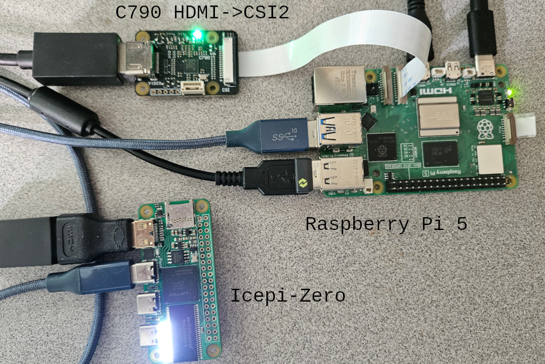
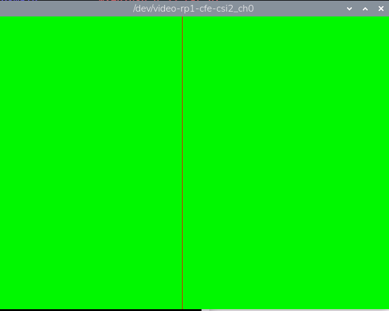
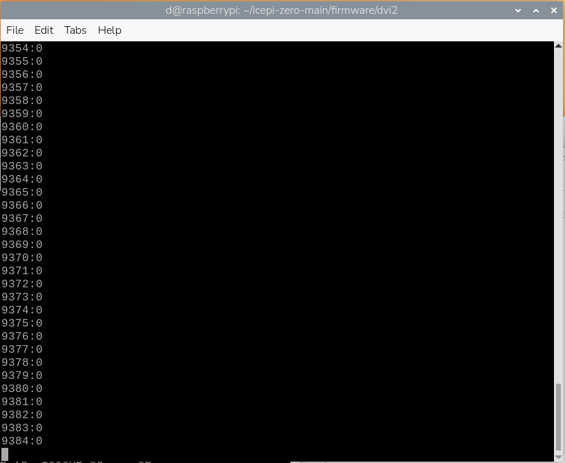

# High Speed Data Input From FPGA to Raspberry Pi 5 via HDMI/CSI2

[Back to Main Part 2](../readme.md)

Now that we know how to capture HDMI at 640x480 with a HDMI to CSI2 adapter board and configuring v4l2, it is time to write code for the FPGA to encode data in the video stream, and to write software to run on the Raspberry Pi 5 to decode the video stream.

First, here is a picture of the setup:

<div align="center">
  <a href="https://github.com/ddommett/RasPi_FPGA2">
    
  </a>
</div>

There is a Raspberry Pi 5 (right), a C790 HDMI to CSI2 adapter board (top left), and an Icepi Zero (lower left). The Icepi Zero is powered (and programmed) by a USB cable from the Raspberry Pi 5. The video output from the Icepi Zero is connected to the C790 input with a black HDMI cable. The output from the C790 is connected to the CSI2 connector on the Raspberry Pi 5 with a flat, gray cable. This looks like a klunky, kludgy setup! We'll shall see how it performs...

## Preparation for Capturing HDMI

Make sure to follow the instructions in [HDMI2CSI-Start](./docs/HDMI2CSI-Start.md) to setup the overlays, udev, and the C790-640x480p script before continuing.

## HDMI Data from FPGA

The folder [21-Icepi-Zero-640x480](../21-Icepi-Zero-640x480) contains source code for the Icepi Zero - it is going to "encode" dummy data to feed into the Raspberry Pi 5. It is a modified version of one of the examples that can be found in the repository for the Icepi Zero (the DVI example). This is firmware to run on the Icepi Zero and output a HDMI signal. To keep things simple, it cycles the whole screen through shades of red, then green, then blue. A complete cycle lasts about 5 seconds before repeating indefinitely. The video output is 60 frames per second. Every frame is given a unique frame number, and this frame number is embedded into pixel number 300 on every line in a frame. This frame number is a 24-bit unsigned integer and so won't repeat for approximately 77 hours. To build the project:

```
make build 
```

(Just type "make" with no arguments to program the bitstream into the Icepi Zero, or use the ConfigIcepi program developed earlier.)

The following picture shows an example of this firmware running and the output being captured:

<div align="center">
  <a href="https://github.com/ddommett/RasPi_FPGA2">
    
  </a>
</div>

Note the "black" line down the middle. This is the frame number - this won't look like a bright color until it has increased significantly. (For simplicity it is just repeated on every line.) It is this frame number that will be used by software running on the Raspberry Pi 5 to verify that a frame is not only being captured correctly, but also to verify if any frames are dropped (signifying lost information in a real application).

## Capturing HDMI frames in a C App.

With the FPGA on the Icepi Zero sending "data" into the Raspberry Pi via HDMI/CSI2, it is now time to write our own program to catch the "data".

The folder [22-Capture-HDMI-640x480](../22-Capture-HDMI-640x480) contains source code to compile and run on the Raspberry Pi. 

It requires some dependencies (opencv):

```
sudo apt install -y build-essential cmake libopencv-dev
```

To build the app:

```
g++ Capture-640x480.cpp -o Capture-640x480 `pkg-config --cflags --libs opencv4`
```

To run:

```
./Capture-640x480
```

The following picture shows the software running (not very exciting):

<div align="center">
  <a href="https://github.com/ddommett/RasPi_FPGA2">
    
  </a>
</div>

What's happening? The C app is capturing frames as fast as possible (or as fast as they are available). It is printing out every frame number that it reads, followed by the number of "errors". It always remembers the last frame number it read, and if the next frame number does not equal the last frame plus one, then it increases the error count. After 10 million frames (about 46 hours) it will stop and print the total errors.

Note that the C app is running in userspace (not kernel space), has no special priorities associated with the process, is running under Wayland on a windowed GUI, AND is calling a "printf" like function to print to the terminal. 

THIS RAN FOR 46 HOURS WITHOUT A SINGLE ERROR!

Could this approach really be this "easy" and this successful. Afterall, we didn't have to write any kernel code, or research process priorities, or boot into different logins (GUI or non-GUI). We don't have to write directly to any cpu registers, or do any "bit-banging".  What initially looked like a kludgy approach to getting high speed data into a Raspberry Pi 5 has worked very well. (A resolution of 640x480 with 24 bits per pixel is a data rate of approximately 55MBps - well past the original goals!)

[Back to Main Part 2](../readme.md)


