# Understanding the JTAG Interface on the Icepi Zero

[Back to Main Part 2](../readme.md)

## The Basic Setup

The major components of the Icepi Zero system are shown in the following diagram. To download a program into the FPGA, the software will use the FTDI library (libftdi1). The FTDI library will handle the complexity of the USB interface to transmit bytes to/from the FT231X chip on the board. Four of the pins from the FT231X are wired to the JTAG interface of the FPGA. The software will 'bit-bang' the JTAG signals to the FPGA to download a program. 

<div align="center">
  <a href="https://github.com/ddommett/RasPi_FPGA2">
    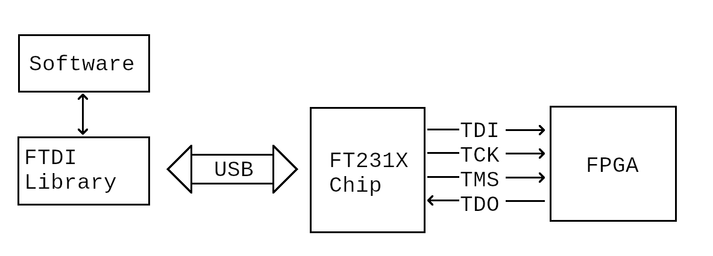
  </a>
</div>

## JTAG section inside the FPGA

The JTAG specification defines the Test Access Port (TAP) state diagram, which defines how instructions or data are sent through JTAG:

<div align="center">
  <a href="https://github.com/ddommett/RasPi_FPGA2">
    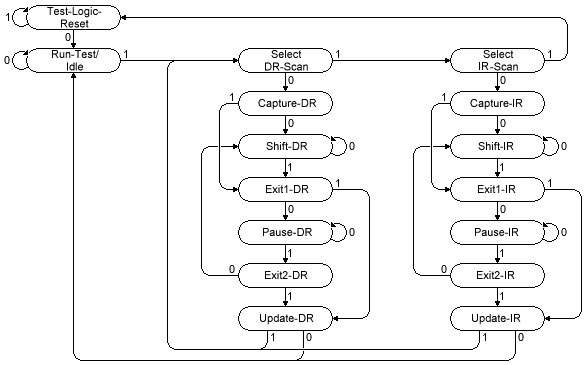
  </a>
</div>

(As of 2026, a nice website which contains a helpful explanation of JTAG is [this website](https://medium.com/@aliaksandr.kavalchuk/diving-into-JTAG-protocol-part-1-overview-fbdc428d3a16).)

The JTAG section of the FPGA contains a state machine (defined by the diagram) that contains two special registers: the Instruction Register, and the Data Register. Conceptually, the JTAG section of the FPGA (in this case a Lattice ECP5) also contains a set of registers (like a memory) where each register is located at an address as shown in the following table:

<table align="center" border="1">
  <tr>     <th>Address</th>    <th>Register</th>  </tr>
  <tr>     <td>0x0E</td>    <td>Erase SRAM (bit 0)</td>   </tr>
  <tr>     <td>0x1C</td>    <td>Preload Sample Data</td>   </tr>
  <tr>     <td>0x26</td>    <td>Disable In-system Configuration (ISC)</td>   </tr>
  <tr>     <td>0x3C</td>    <td>Status Register</td>   </tr>
  <tr>     <td>0x79</td>    <td>Refresh</td>  </tr>
  <tr>     <td>0x7A</td>    <td>Bitstream Burst - program data</td>  </tr>
  <tr>     <td>0xC6</td>    <td>Enable In-system Configuration (ISC)</td>  </tr>
  <tr>     <td>0xE0</td>    <td>ID Register (32 bits)</td>  </tr>
  <tr>     <td>0xF0</td>    <td>Check Busy</td>  </tr>
</table>

Take note that this is just a concept. This is not a complete list of all available registers and not all addresses are used. The size of each register at each location can vary. Reading the ID, writing to a register, and programming the SRAM in the FPGA, are all accomplished by accessing these registers. To access a particular register, you must set the Instruction Register to the correct address. Once the Instruction Register is set, you can read/write that register by reading/writing the Data Register.

Some of the opcodes in the above table are part of IEEE 1532 (standardized). Some of them are Lattice-specific extensions (not well documented).
 
## FTDI Library 

libftdi1 is an open source software library that provides helpful functions for interacting with FTDI chips (like the FT231X) via USB. It provides functions like 'ftdi_write_data' and 'ftdi_read_data' to send or receive bytes to or from a FTDI chip that is sitting on the USB. 

## FT231X USB-UART

The FT231X chip provides a convenient UART on the USB. It provides all the signals that could be found on a serial port in the old days such as:

<table align="center" border="1">
  <tr>    <th>Name</th>    <th>Description</th>  </tr>
  <tr>    <td>RXD</td>    <td>Receive Data</td>  </tr>
  <tr>    <td>TXD</td>    <td>Transmit Data</td>  </tr>
  <tr>    <td>RTS</td>    <td>Request To Send</td>  </tr>
  <tr>    <td>CTS</td>    <td>Clear To Send</td>  </tr>
  <tr>    <td>DSR</td>    <td>Data Set Ready</td>  </tr>
  <tr>    <td>DTR</td>    <td>Data Terminal Ready</td>  </tr>
  <tr>    <td>DCD</td>    <td>Data Carrier Detect</td>  </tr>
  <tr>    <td>RI</td>    <td>Ring Indicator</td>  </tr>
</table>

The RXD and TXD signals were used to transmit data between devices such as a PC and modem, while the other signals were used as control and status lines. The FTDI library is nice and generic in the sense that all you have to do to set a signal high or low is to send a byte to the FT231X. Each of these signals is mapped to a bit in an 8-bit byte. You can make these signals on the FT231X do all sorts of things by writing a sequence of bytes where you set or clear the corresponding bits in each byte.

The JTAG interface only requires four signals, so we don't need to use all eight signals on the FT231X. Since the JTAG interface is serial, it would seem logical to use the TXD and RXD lines for reading and writing bytes but unfortunately the JTAG interface does not work in a compatible way. Instead, we will bit-bang the serial protocol on four of the control signals.

A byte, sent to the FT231X is mapped to the UART signals in the following way (and due to the layout of the PCB, the last row shows how the JTAG signals map to a bit in the byte):

<table align="center" border="1">
  <tr>    <th>Bit:</th>    <th>7</th>    <th>6</th>    <th>5</th>    <th>4</th>    <th>3</th>    <th>2</th>    <th>1</th>    <th>0</th>  </tr>
  <tr>    <td></td>    <td>RI</td>    <td>DCD</td>    <td>DSR</td>    <td>DTR</td>    <td>CTS</td>    <td>RTS</td>    <td>RXD</td>    <td>TXD</td>  </tr>
  <tr>    <td></td>    <td>TDI</td>    <td>TMS</td>    <td>TCK</td>    <td></td>    <td>TDO</td>    <td></td>    <td></td>    <td></td>  </tr>
</table>

For example, to set TDI high, send the hex byte 0x80. To set TCK high, send hex byte 0x20. To set both high at the same time, send hex byte 0xA0.


## Programming the FPGA SRAM

The project [20-ConfigIcepi](../20-ConfigIcepi) contains an example source code to program the ECP5 FPGA on the Icepi-Zero board; it can configure the SRAM of the FPGA and it can program the onboard flash. It requires that libftdi1 be installed. From a Linux terminal, to compile, link, and run it (needs a bitstream.bit file to run - the file included in this repository is the "blinky" example):

```bash 
/usr/bin/c++ -I/usr/local/include/libftdi1 -O3  -std=gnu++11 -o ConfigIcepi.o -c ConfigIcepi.cpp
/usr/bin/c++ -O3 ConfigIcepi.o -o ConfigIcepi -lftdi1
./ConfigIcepi bitstream.bit
```

Before running ConfigIcepi, connect a USB cable to the programming port of the Icepi Zero (circled in the following image):

<div align="center">
  <a href="https://github.com/ddommett/RasPi_FPGA2">
    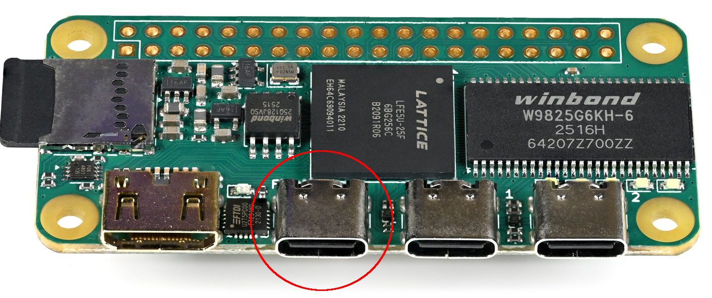
  </a>
</div>

### Resetting the JTAG State Machine

The JTAG state machine is defined in such a way that no matter what state it is currently in, you can always return to the RESET state by holding TMS high and sending 5 clock pulses. On power up, we would expect the state machine to be in the RESET state, but it is good practice to specifically set it to the RESET state before we start doing anything.

The JTAG specification states that to reach the RESET state we must hold TMS high for five TCK pulses. This means we must set TMS high while TCK is low, and then set TCK high, and then repeat four more times. If we send hex byte 0x40 to the FT231X, TMS will go high. If we then send hex byte 0x60 (0x40 + 0x20) TCK will go high while TMS remains high. If we then send 0x40 again, TMS remains high while TCK goes low. Therefore, to set the JTAG state machine to RESET, we must send 10 bytes: 0x40, 0x60, 0x40, 0x60, 0x40, 0x60, 0x40, 0x60, 0x40, 0x60. (Changing states in the JTAG state machine does not involve TDI or TDO.) 

In the ConfigIcepi software, the SendBuffer function is called to send bytes to the FTDI chip, for example:

```
SendBuffer(string("") + "000000",
           string("") + "111110");
```

The SendBuffer function takes two strings; the first string represents the data to be sent on the TDI signal, and the second string represents the data to be sent on the TMS signal. (Strings of ones and zeros were used so that a human can "see" the waveform.) In the above example, six zeros will be sent on the TDI signal and five ones followed by one zero are sent on the TMS signal because we want to reset the state machine with five ones, and then move the state machine to the IDLE state by sending a zero on TMS. The SendBuffer function will take these two strings (each six characters long) and will create a buffer of 12 bytes. Each odd byte will be a combination of the two strings (TDI and TMS), each even byte will include TCK - this enables the sending of six clock pulses and each one will clock in the combination of TDI and TMS.

With a scope hooked up to the JTAG signals, here is what those signals look like when the above example is executed in the software:

<div align="center">
  <a href="https://github.com/ddommett/RasPi_FPGA2">
    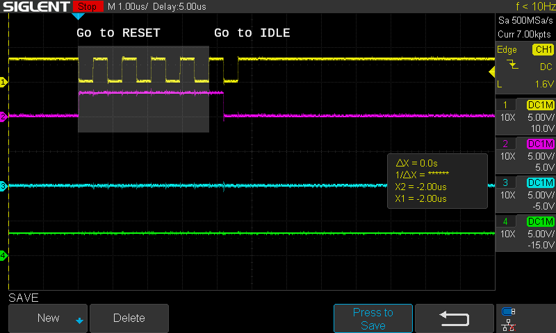
  </a>
</div>

The yellow line is the TCK signal, magenta is the TMS signal, cyan is the TDI signal, and green is the TDO signal. Note in the image below that the JTAG state machine should now be in the highlighted IDLE state.

<div align="center">
  <a href="https://github.com/ddommett/RasPi_FPGA2">
    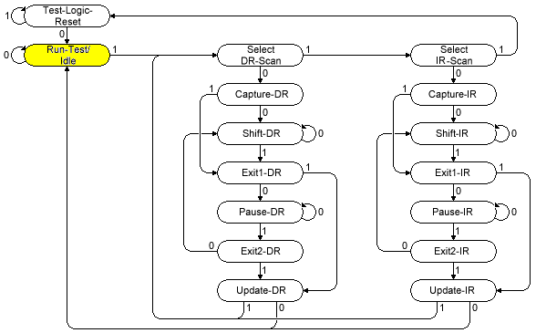
  </a>
</div>

Note that the only part of TCK that matters is the low-to-high transition. TCK could have started in the low position in the above transaction, but when we say 'send a clock pulse' we just mean create a low-to-high transition on the TCK signal. For every single 'bit' that we want to send to the JTAG port, we must send two bytes to the FT231X chip.

### Read the JTAG ID of the FPGA

This is not necessary to program the FPGA, but it shows how to read data from the FPGA JTAG. To achieve this, it must send a byte to the Instruction Register (0xE0 is the address of the ID register). The following steps are taken when sending a byte to the instruction register: change JTAG state to SHIFT_IR, send the command byte, and then change JTAG state from EXIT1_IR back to IDLE. Reading the 32-bit JEDEC ID register requires the following steps: change JTAG state to SHIFT_DR, send 32 bits (read 32 bits from TDO), and then change JTAG state to IDLE. The following line of code calls SendBuffer with appropriate waveforms for TDI and TMS:

```
// ID Code = 0xE0 = 11100000 --rev--> 00000111
SendBuffer(string("") + "0000" + "00000111" + "00" + "000" + "00000000000000000000000000000000" + "00",
           string("") + "1100" + "00000001" + "10" + "100" + "00000000000000000000000000000001" + "10");
```

The JTAG signals:

<div align="center">
  <a href="https://github.com/ddommett/RasPi_FPGA2">
    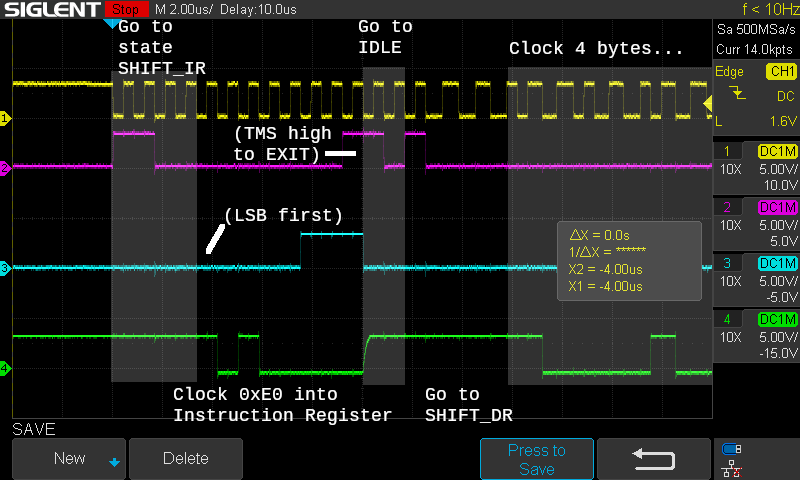
  </a>
</div>

In the waveform capture above, the first 4 clock pulses change the JTAG state to SHIFT_IR (TMS = "1100"), the next 8 clock pulses clock in the command (0xE0) and note that the command is sent LSB first (looks like 0x07 as we read left-to-right), and the next 2 clock pulses move the JTAG state machine from EXIT1_IR back to IDLE (TMS = "10"). Note that it is common to set TMS high on the last bit of any register that is being written to - this properly moves the JTAG state machine from SHIFT_IR to EXIT1_IR (or from SHIFT_DR to EXIT1_DR).

After properly writing 0xE0 to the JTAG Instruction Register, the next 3 clocks change the JTAG state machine to SHIFT_DR, and then the clocks start reading 32-bits from the JEDEC ID register. The next capture zooms out so that the full waveform can be seen. (Note that TMS is set high on the 32nd bit.) The final two clock pulses (TMS = "10") send the state machine back to IDLE.

<div align="center">
  <a href="https://github.com/ddommett/RasPi_FPGA2">
    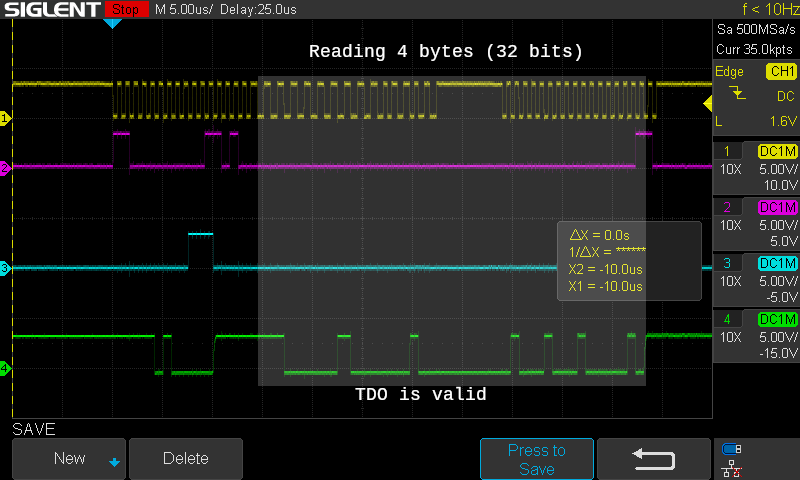
  </a>
</div>

Let's look at the above process in more detail. First, a TMS waveform of 1100 was clocked into the JTAG port and the state changed to SHIFT_IR:

<div align="center">
  <a href="https://github.com/ddommett/RasPi_FPGA2">
    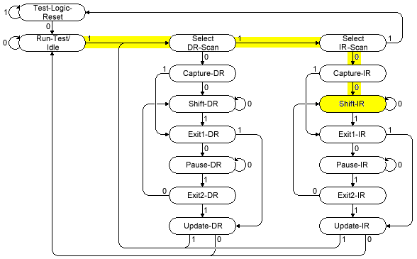
  </a>
</div>

The JTAG state machine is now ready to receive a byte of data into the instruction register. Now we must work with the TDI signal.

An 8-bit byte must be serialized into 16 bytes (two bytes for each bit - one with TCK low and one with TCK high). The 8-bit byte must be serially clocked into the JTAG port LSB first. 

As the LSB of 0xE0 is 0, the first byte sent via USB must set TDI low with TCK low, and the second byte sent via USB must keep TDI low while setting TCK high. The third byte will set TDI to the next bit of the instruction byte (TCK low), and the fourth byte will set TCK high. Each odd numbered byte will setup the data bit on TDI, and each even numbered byte will clock the TCK signal high.

A buffer of bytes is sent through the USB to the FTDI chip with a call to the ftdi library function 'ftdi_write_data'.

As stated above, the ID register is at address 0xE0 (binary 11100000), and if it is to be sent serially, LSB first, then we need to send the bits as: 0,0,0,0,0,1,1,1. TDI is tied to the 'RI' pin of the FTDI chip (the old 'RING INDICATOR' from days of yore), which is bit 0x80. TCK is tied to the 'DSR' pin of the FTDI chip (the old 'DATASET READY'), which is bit 0x20. The following table shows how each of the 16 bytes must look:

<table align="center" border="1">
  <tr>    <th>Byte</th>    <th>TDI</th>    <th>TCK</th>    <th>Value</th>  </tr>
  <tr>    <td>1</td>    <td>0</td>    <td>low</td>    <td>0x00</td>  </tr>
  <tr>    <td>2</td>    <td>0</td>    <td>high</td>    <td>0x20</td>  </tr>
  <tr>    <td>3</td>    <td>0</td>    <td>low</td>    <td>0x00</td>  </tr>
  <tr>    <td>4</td>    <td>0</td>    <td>high</td>    <td>0x20</td>  </tr>
  <tr>    <td>5</td>    <td>0</td>    <td>low</td>    <td>0x00</td>  </tr>
  <tr>    <td>6</td>    <td>0</td>    <td>high</td>    <td>0x20</td>  </tr>
  <tr>    <td>7</td>    <td>0</td>    <td>low</td>    <td>0x00</td>  </tr>
  <tr>    <td>8</td>    <td>0</td>    <td>high</td>    <td>0x20</td>  </tr>
  <tr>    <td>9</td>    <td>0</td>    <td>low</td>    <td>0x00</td>  </tr>
  <tr>    <td>10</td>    <td>0</td>    <td>high</td>    <td>0x20</td>  </tr>
  <tr>    <td>11</td>    <td>1</td>    <td>low</td>    <td>0x80</td>  </tr>
  <tr>    <td>12</td>    <td>1</td>    <td>high</td>    <td>0xA0</td>  </tr>
  <tr>    <td>13</td>    <td>1</td>    <td>low</td>    <td>0x80</td>  </tr>
  <tr>    <td>14</td>    <td>1</td>    <td>high</td>    <td>0xA0</td>  </tr>
  <tr>    <td>15</td>    <td>1</td>    <td>low</td>    <td>0xC0</td>  </tr>
  <tr>    <td>16</td>    <td>1</td>    <td>high</td>    <td>0xE0</td>  </tr>
</table>

Note that it *is* possible to send two bits simultaneously if two signals need to change at the same time. When we send data to the Instruction Register or Data Register, TMS needs to be set high on the last bit to make the state machine transition to one of the EXIT states and *this* is why the last two bytes in the above table were 0xC0 and 0xE0 instead of 0x80 and 0xA0. The byte 0xC0 represents setting the MSB of TDI (high) and setting TMS high, while 0xE0 represents holding those two signals high and clocking TCK.

When this is complete, the Instruction Register has been written (set to 0xE0) and the JTAG state machine is left in the state EXIT1_IR (it stayed in SHIFT_IR for 8 clock pulses to shift in the byte and then moved to EXIT1_IR on the eighth pulse):

<div align="center">
  <a href="https://github.com/ddommett/RasPi_FPGA2">
    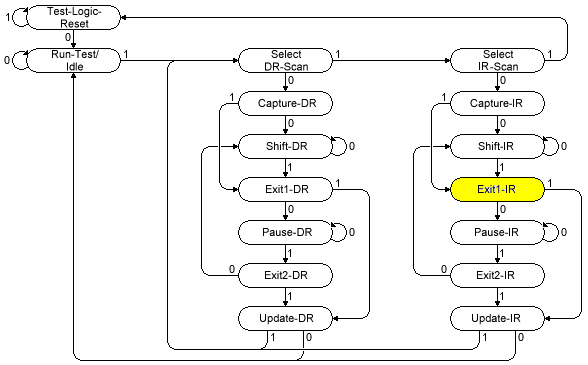
  </a>
</div>

The next two clocks (TMS set to "1" and then "0") send it to IDLE:

<div align="center">
  <a href="https://github.com/ddommett/RasPi_FPGA2">
    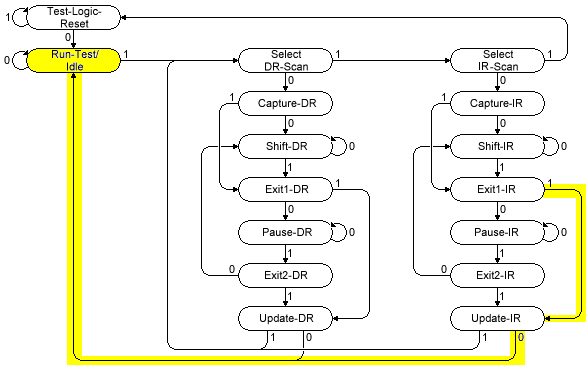
  </a>
</div>

The whole point of writing 0xE0 to the Instruction Register was so that we can read back the ID from the FPGA. This is achieved by 'writing' to the Data Register and sampling the TDO signal. In the software, this is accomplished by calling ftdi_write_data (which will write data out on TDI and read the data coming in on TDO, storing the read data into an internal buffer), and then calling ftdi_read_data to return the data that was read. (No bytes are sent via USB when calling ftdi_read_data and nothing changes on the JTAG signals).

Sending 3 clock pulses with TMS = 100 changes the state machine to SHIFT_DR:

<div align="center">
  <a href="https://github.com/ddommett/RasPi_FPGA2">
    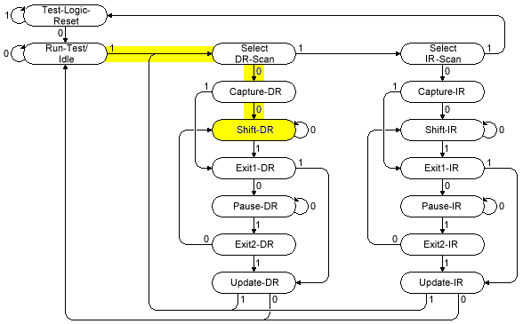
  </a>
</div>

Then 32 bits are "written" to the register, and the FTDI chip will sample the TDO signal on each clock pulse. In the above capture, it is one of the few times where we see activity on the TDO signal that we care about. Each clock pulse on TCK, which writes a "dummy" bit, is actually clocking out an ID bit on TDO.

The ID code is 0x41111043 and that should match with the waveform when reading 32 bits (LSB first on TDO). (The waveform is duplicated in the below image).

<div align="center">
  <a href="https://github.com/ddommett/RasPi_FPGA2">
    
  </a>
</div>

### Animation of Reading the JTAG ID


https://github.com/user-attachments/assets/cd167087-b5d1-4a49-be37-7b2abe45dfc6


### Starting to Download a Program to the SRAM

So far, the software has demonstrated the following three things (by sending bytes via the ftdi library to control the JTAG signals):

1) How to change states within the JTAG state machine inside the FPGA.

2) How to send a byte to the Instruction Register inside the JTAG state machine.

3) How to read from the Data Register inside the JTAG state machine.

We are now ready to consider how to program the SRAM inside the FPGA. The first thing to do is send "preload" data to ensure that I/O pins start in a safe, known state.

Send the PreloadSampleData (send 0x1C to the Instruction Register, then send 26 bytes of 0xFF to the Data Register):

```
// PRELOAD/SAMPLE = 0x1C = 00011100 --rev--> 00111000  + 26 bytes of 0xFF
SendBuffer(string("") + "0000" + "00111000" + "00" + "000" + string(25*8, '1') + "11111111" + "00",
           string("") + "1100" + "00000001" + "10" + "100" + string(25*8, '0') + "00000001"+ "10");
```

<div align="center">
  <a href="https://github.com/ddommett/RasPi_FPGA2">
    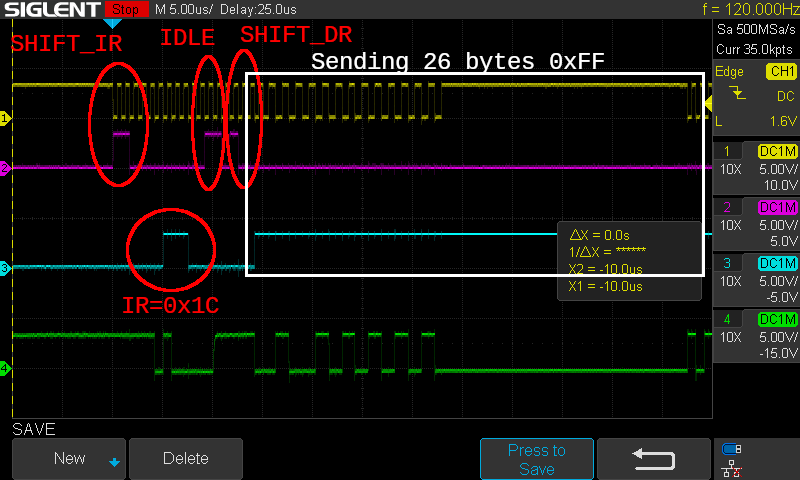
  </a>
</div>

The sending of the 26 bytes goes on for a long time as seen when the timescale is zoomed out:

<div align="center">
  <a href="https://github.com/ddommett/RasPi_FPGA2">
    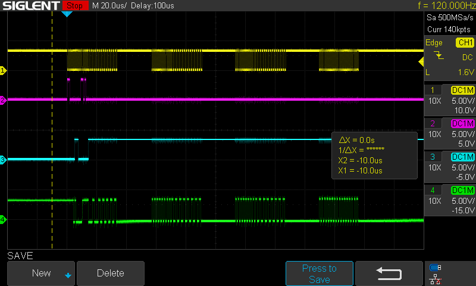
  </a>
</div>


Next, we must enable in-system configuration (ISC). Send the code to Enable ISC (0xC6) to the Instruction Register, and then send 0x00 to the Data Register:

```
// ISC Enable = 0xC6 = 11000110 --rev--> 01100011
SendBuffer(string("") + "0000" + "01100011" + "00" + "000" + "00000000" + "00",
           string("") + "1100" + "00000001" + "10" + "100" + "00000001" + "10");
```

<div align="center">
  <a href="https://github.com/ddommett/RasPi_FPGA2">
    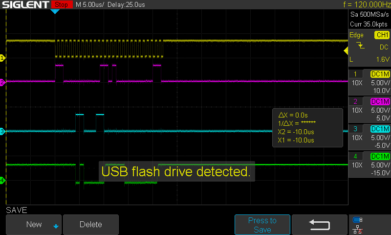
  </a>
</div>

Send the code to erase the SRAM (0x0E) to the Instruction Register, and then send 0x01 to the Data Register:

```
// ERASE_SRAM = 0x0E = 00001110 --rev--> 01110000  + Data Register = 1 
SendBuffer(string("") + "0000" + "01110000" + "00" + "000" + "10000000" + "00",
           string("") + "1100" + "00000001" + "10" + "100" + "00000001" + "10");
```

<div align="center">
  <a href="https://github.com/ddommett/RasPi_FPGA2">
    
  </a>
</div>

### Downloading a Program to the SRAM

So far, we have sent the preload data, enabled ISC, and cleared the SRAM. It is now ready to receive the configuration data to re-program the SRAM. Send command LSC_BITSTREAM_BURST (0x7A) to the Instruction Register:

```
// LSC Bitstream Burst = 0x7A = 01111010 --rev--> 01011110 
SendBuffer(string("") + "0000" + "01011110" + "00",
           string("") + "1100" + "00000001" + "10");
```

<div align="center">
  <a href="https://github.com/ddommett/RasPi_FPGA2">
    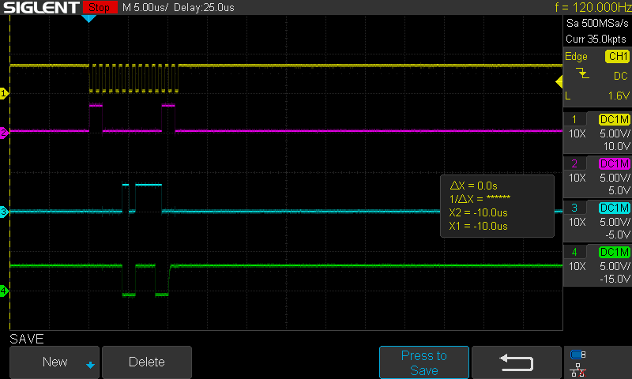
  </a>
</div>

The software opens the data file containing the FPGA program and sends a sequence of buffers - as many buffers as necessary until all the file has been sent. It does this by continually writing to the JTAG Data Register.

Here is the first buffer:

<div align="center">
  <a href="https://github.com/ddommett/RasPi_FPGA2">
    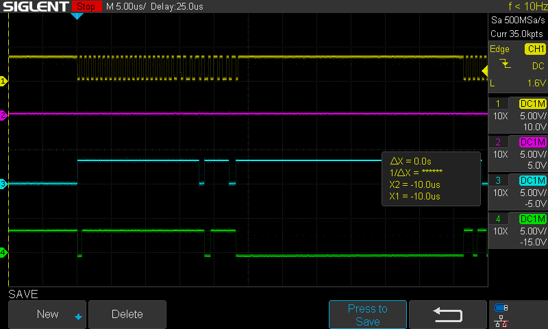
  </a>
</div>

Zoom out so we can see more of the first buffer:

<div align="center">
  <a href="https://github.com/ddommett/RasPi_FPGA2">
    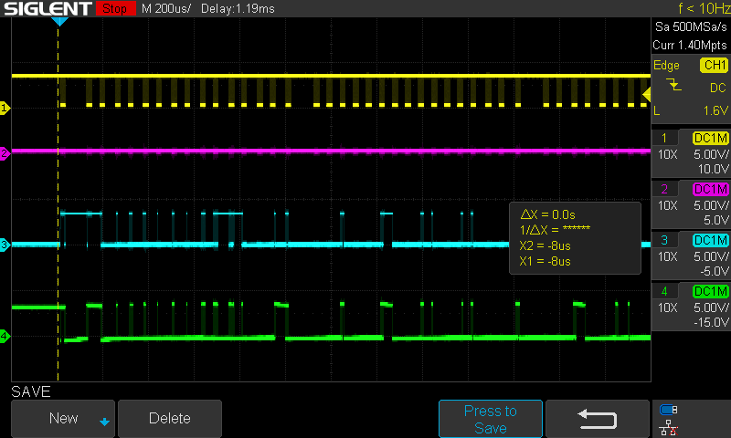
  </a>
</div>

### Ending the SRAM Download

After all the configuration data has been sent, send the command to Disable the ISC:

```
// ISC Disable = 0x26 = 00100110 --rev--> 01100100   In-System Configuration Disable 
SendBuffer(string("") + "0000" + "01100100" + "00",
           string("") + "1100" + "00000001" + "10");
```

If all has gone well, the FPGA will now be running the downloaded program. (What is not shown throughout this process is that after sending most commands, the Status Register is read to determine if the command has completed before moving onto the next command - this is similar to reading the JEDEC ID.)

## Programming the Flash

Programming the SRAM is all well and good, but when power is turned off, the program is lost. Unless you plan on configuring the FPGA each time it is powered up, you need to program a non-volatile chip that can configure the FPGA on power up. The Icepi Zero includes a W25Q128JVS flash chip connected to a special SPI port on the ECP5, and the next step is understanding how to download a program into this flash chip for a more permanent solution. This requires getting into more Lattice-specific opcodes and algorithms.

### Beginning the Process

Initially, we take some of the same steps as when programming the SRAM - Enable ISC, Erase the SRAM, then Disable the ISC. After these initial steps, we can interface with the SPI on the ECP.

### Interfacing with the SPI

The next thing we need to do is to put the FPGA into the mode where JTAG signals are passed through to the SPI - first, send a hex byte 0x3A to the Instruction Register, then send 0x68 to the Data Register (this is Lattice specific). These commands allow the JTAG signals to pass-through to the SPI pins of the FPGA; writing to the Data Register will cause TCK to appear on FLASH_CLK (the CLK pin of the W25Q128JVS) and TDI to appear on FLASH_MOSI (the DI pin of the W25Q128JVS). Note that when the FPGA is in this mode, the TCK pulses that occur when writing the Data Register are passed through to the flash chip, but TCK pulses used to transition around the JTAG state machine are not. Also, when in this mode, the FLASH_CS signal will go low each time the Data Register is written because the internals of the ECP5 know that this is necessary to address the external flash chip. 

From this point forward, we are communicating with the flash.

Step one for the flash is to enable the reset on the flash chip (command 0x66). Watch the signals as 0x66 is written to the JTAG Data Register:

<div align="center">
  <a href="https://github.com/ddommett/RasPi_FPGA2">
    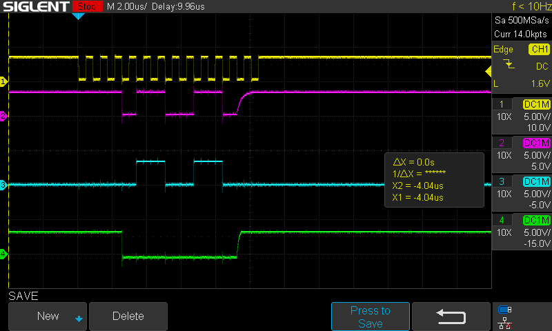
  </a>
</div>

In the above picture, the scope probes have been moved - yellow is still TCK, but magenta is now FLASH_MOSI (or DI), cyan is still TDI, and green is FLASH_CS (or /CS). Unfortunately, it was not possible to place a probe on the FLASH_CLK signal to the flash chip because doing so would stop the flash process from succeeding - possibly an active scope probe to reduce capacitive load would have helped. This capture shows that the TDI signal (cyan) is indeed replicated on the DI signal (magenta) and that the /CS signal (green) goes low for the transaction. This is all due to having sent 0x3A and 0x68 to the JTAG Instruction and Data registers. Note also, that command bytes are sent to the W25Q128JVS with the most significant bit (MSB) first, which makes the waveforms a bit more human-readable.

Now, if a scope probe *IS* connected to FLASH_CLK (the green channel has been moved from /CS to FLASH_CLK):

<div align="center">
  <a href="https://github.com/ddommett/RasPi_FPGA2">
    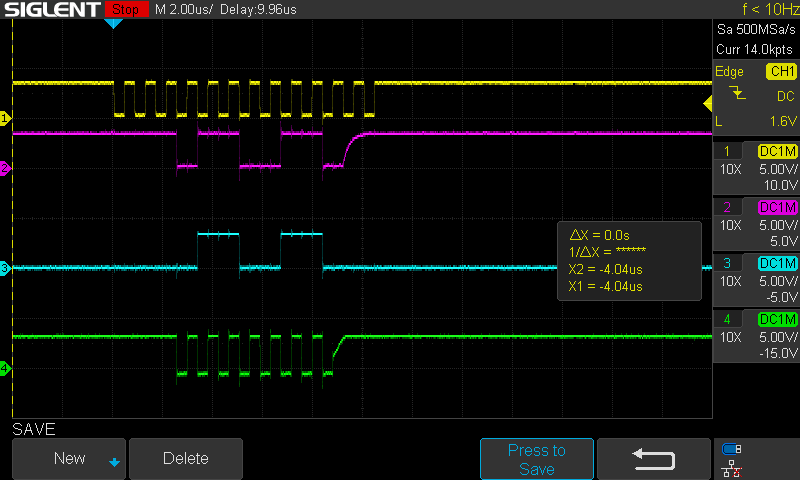
  </a>
</div>

The above capture shows how the JTAG TCK pulses that surround the transaction to the flash chip are NOT output onto FLASH_CLK. The first three pulses transition the JTAG state machine to the SHIFT_DR state; the last two pulses transition the JTAG state machine back to IDLE. Only the eight TCK pulses in the middle (shifting in the byte into the Data Register) are passed through to FLASH_CLK.

Now, send the actual reset command to the flash chip (0x99):

<div align="center">
  <a href="https://github.com/ddommett/RasPi_FPGA2">
    
  </a>
</div>

Note that commands to the flash chip (W25Q128) are MSB first. The green channel has been removed from /CS and is now connected to DO on the flash chip.

Let's read the JEDEC code of the flash W25Q128 flash chip. This is achieved by sending command 0x9F to the flash chip (write to the JTAG Data Register) and then continuing to "write" 4 more dummy bytes to the Data Register which has the effect of sending 32 more clocks to the flash chip. On each clock, the flash chip will set FLASH_MISO (DO) to a bit of the JEDEC code. See the following image where the green channel is connected to DO (echoed to TDO and read back through the FT231X and to the PC via USB):

<div align="center">
  <a href="https://github.com/ddommett/RasPi_FPGA2">
    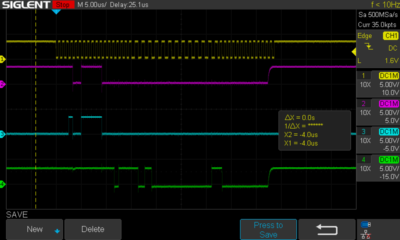
  </a>
</div>

Only the first 3 bytes are relevant for the 0x9F command and they are 0xEF, 0x40, and 0x18.

Before we can erase or write any sector in the flash chip, we must send a 'Write Enable' command. To verify that the flash chip has received the 'Write Enable' command, we read back the Status Register looking for the 'Write Enable Latch' to be set (0x02).

Let's send the 'Write Enable' command (0x06):

<div align="center">
  <a href="https://github.com/ddommett/RasPi_FPGA2">
    
  </a>
</div>

Now, to read the status register, send the Read Status Register command (0x05) and then "write" one more byte to the JTAG Data Register:

Here we write the Read Status Register command:

<div align="center">
  <a href="https://github.com/ddommett/RasPi_FPGA2">
    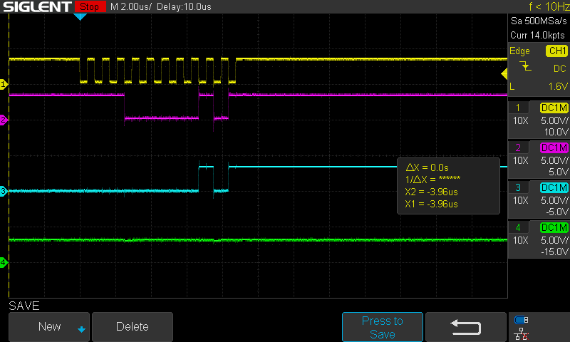
  </a>
</div>

And here we write one more byte to "read" the status register on DO (JTAG TDO):

<div align="center">
  <a href="https://github.com/ddommett/RasPi_FPGA2">
    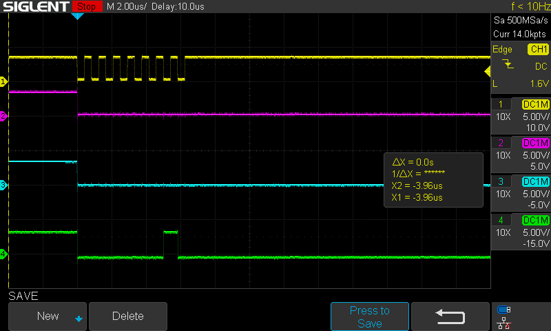
  </a>
</div>

Note that the byte read back has the 'Write Enable Latch' (0x02) bit set (green channel is DO/TDO), so the flash chip *is* ready for an erase or write command. The 'Write Enable Latch' is cleared after each erase or write command that is sent to the flash chip, therefore it is necessary to send the 'Write Enable' command before each and every erase/write command (and we should verify it is successful).

Now that the 'Write Enable Latch' is set, we can actually start erasing sectors by sending an Erase command (0xD8) followed by three bytes of the address to erase (in this case 0x000000):

<div align="center">
  <a href="https://github.com/ddommett/RasPi_FPGA2">
    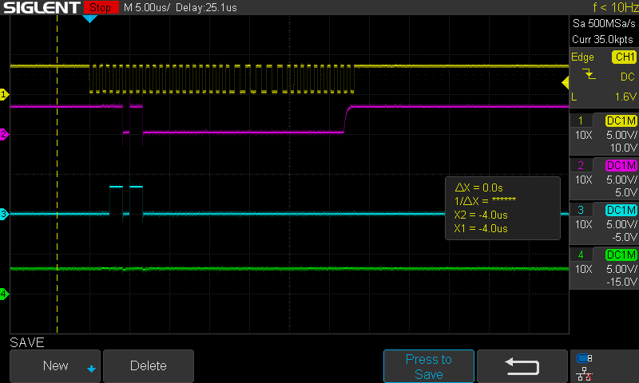
  </a>
</div>

Once the relevant sectors are erased, the new program data can be written to the flash. This follows a similar repetitive loop like erasing: send a 'Write Enable' command, check that 'Write Enable Latch' is set, send a data packet, and finally wait for the flash chip to complete writing that data. A data packet consists of a 'Write' command followed by 3 bytes for the address of the sector to write, followed by a number of bytes of data.

Now we cut the data file into 'buffer' sized chunks, and for each chunk, we send a 'Write Enable' command, then we send the actual data. Here is a capture showing a data buffer being sent:

<div align="center">
  <a href="https://github.com/ddommett/RasPi_FPGA2">
    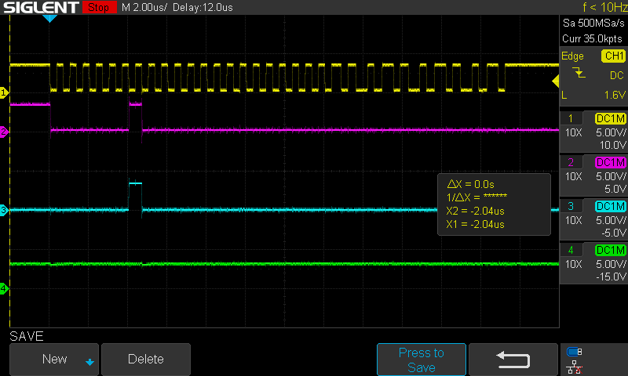
  </a>
</div>

Note that the 'Write' command is 0x02, and the address is 0x000000 in this capture. If we zoom out we can see more of the data that follows:

<div align="center">
  <a href="https://github.com/ddommett/RasPi_FPGA2">
    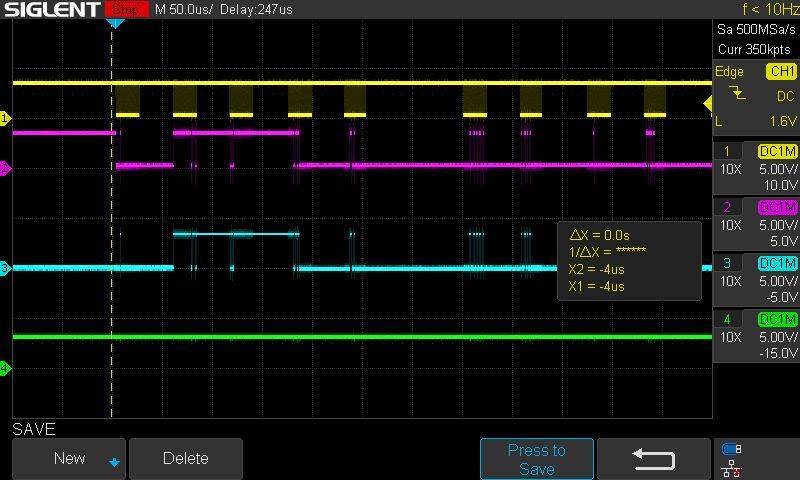
  </a>
</div>

After each erase command, or write command, the flash chip will set the 'Work in Process' bit in the status register. So after each buffer is sent (or after each erase command above), we poll the Status Register. This is not shown in any capture - it looks very similar to checking for the 'Write Enable Latch' except that when waiting for 'Work in Process' to be done, we wait until the bit is cleared before we start to send another command/buffer.

After sending all the data buffers to the flash with the 'Write' command, the task is complete - the flash chip now contains all the data necessary to configure the FPGA on power up!

## Refreshing the FPGA from the Flash

To trigger the FPGA to re-configure itself from the newly programmed flash chip, we now send a new command to the JTAG state machine. (We are no longer communicating with the flash chip - we are changing the Instruction Register in the JTAG state machine.) We send the Refresh command (Lattice specific 0x79):

<div align="center">
  <a href="https://github.com/ddommett/RasPi_FPGA2">
    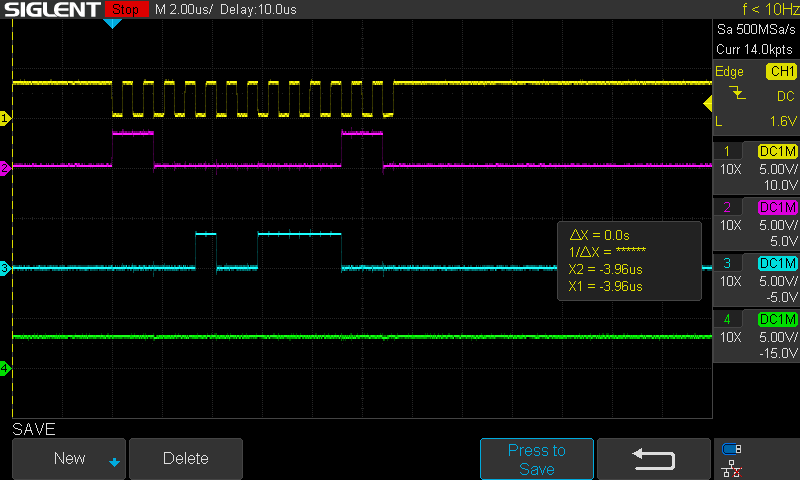
  </a>
</div>

Note that the magenta channel has moved back to the JTAG TMS signal, and we are sending bytes LSB first again.

If all is well, upon receiving the Refresh command, the FPGA will configure itself from the flash chip. We can verify that configuration was successful by reading the JTAG status register and verifying that the 'Status Done' bit is set (0x0100). (This is not shown here.)

[Back to Main Part 2](../readme.md)


